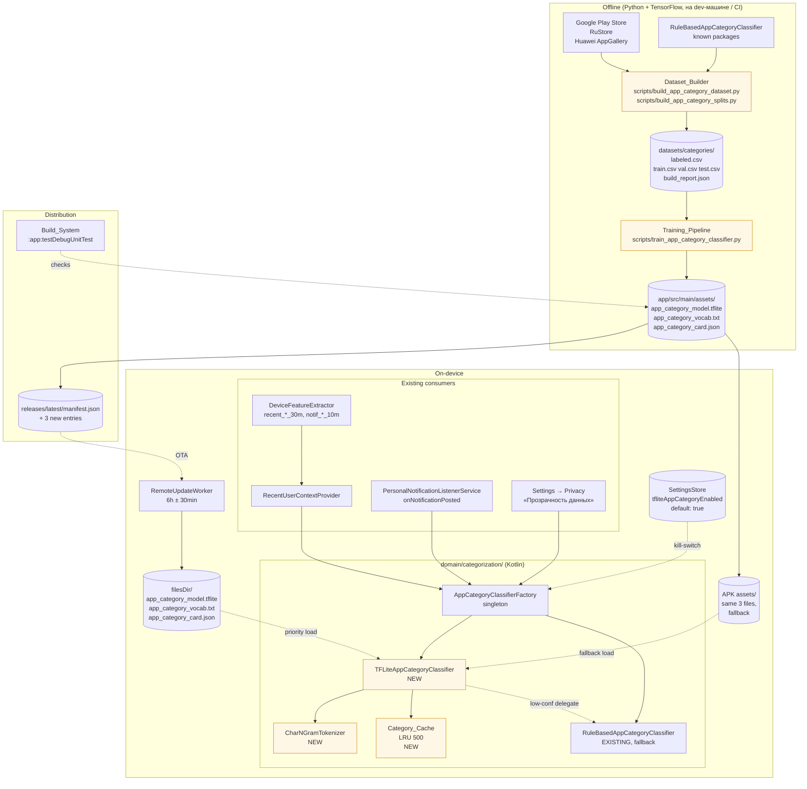
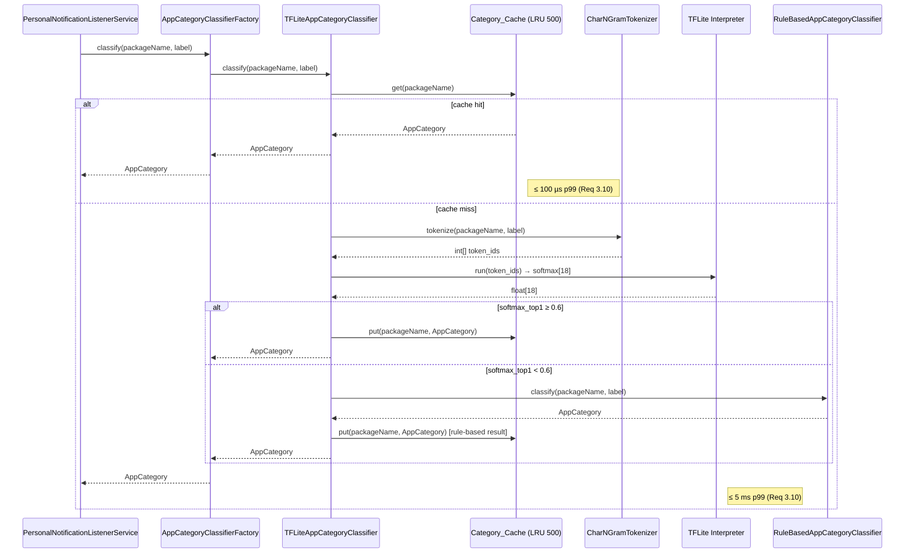

# Design Document

## Overview

Эта спецификация добавляет третью «ИИ» приложения — **App_Category_Model**, on-device char-CNN TFLite-классификатор приложений по `packageName` (с опциональным локализованным `label`) на одну из 18 семантических категорий `AppCategory`. Модель — сиблинг двух уже существующих:

- **Server Model** (TFLite-классификатор спам-номеров, `assets/spam_model.tflite`, обновляется через `RemoteUpdateWorker`, см. [`model-training-pipeline`](../model-training-pipeline/design.md)).
- **Personal Model** (on-device логистическая регрессия по 17 фичам, `DeviceModel`, см. [`on-device-personal-spam-classifier`](../on-device-personal-spam-classifier/design.md)).

Ключевые архитектурные решения:

- **Не замещаем `RuleBasedAppCategoryClassifier`.** Существующая rule-based реализация (~150 известных пакетов + substring-маркеры в `KNOWN_PACKAGES`/`PACKAGE_MARKERS`/`LABEL_MARKERS`) остаётся обязательным fallback-путём. TFLite добавляется поверх через **confidence-gated** делегирование: если `softmax_top1 < Confidence_Threshold` (по умолчанию 0.6), вызов уходит в rule-based. Это исключает «загрязнение» сенсорных фич Personal Model (`recent_bank_app_30m`, `notif_bank_recent_10m` и др.) низкокачественными ML-предсказаниями.
- **Обучение полностью offline (Python + TensorFlow).** Ни один байт телеметрии с устройства не попадает в обучающий корпус. Источники — Google Play Store, RuStore, Huawei AppGallery + Bootstrap_Seed из `RuleBasedAppCategoryClassifier`.
- **Архитектура — char-n-gram (n ∈ {3,4,5}) + три параллельных Conv1D + GlobalMaxPool + Dense(18, softmax).** Sub-1MB после dynamic-range-квантизации. `OTHER` (id 19 в Kotlin-enum) **не предсказывается** Dense-слоем — он зарезервирован для rule-based fallback. Softmax покрывает 18 первых значений `AppCategory` (BANK..PRODUCTIVITY).
- **Дистрибуция — переиспользуем существующий канал.** Те же `releases/latest/manifest.json` + `RemoteUpdateWorker` + 6 ч ± 30 мин периодика, которые уже обслуживают Server Model. Никакого второго worker'а, никакого второго manifest'а. Три новых ассета добавляются в `ALLOWED_FILES`: `app_category_model.tflite`, `app_category_vocab.txt`, `app_category_card.json`.
- **Жёсткая приватность.** Классификатор читает **только** аргументы `packageName` и `label`, переданные в `classify`. Никогда не обращается к `Notification.extras`, `PackageManager.getInstalledPackages`, `LocationManager`, `ClipboardManager`, `content://sms`. Никогда не логирует значения `packageName`/`label` в `android.util.Log`. Никаких новых runtime permissions, никаких новых сетевых каналов вне существующего manifest pull.
- **Рантайм — горячий путь на микросекундах.** `Category_Cache` LRU-500 на `packageName` гарантирует, что повторные `classify(...)` из `PersonalNotificationListenerService.onNotificationPosted` отдаются из памяти за единицы микросекунд. Cache-miss с TFLite-инференсом — ≤ 5 мс p99.
- **Backwards compatibility.** `AppCategory` enum остаётся 20-значным (BANK..OTHER), порядок и числовые id сохраняются, `toNotificationBucket()` маппинг не меняется. **Room schema `notification_event` не мигрируется** — узкий 5-bucket enum `(BANK, MARKETPLACE, MESSENGER, EMAIL, OTHER)`, который пишется в `notification_event.categoryBucket`, продолжает приходить из того же `AppCategory.toNotificationBucket()`. Сигнатура интерфейса `AppCategoryClassifier` зафиксирована и не расширяется.
- **Property-based корректность.** Три инварианта проверяются автоматически на каждой сборке: (1) порядок Kotlin-enum `AppCategory` ≡ `categories_order` из `app_category_card.json` ≡ `CATEGORIES` в `train_app_category_classifier.py`; (2) dimension softmax-выхода TFLite ровно 18; (3) `softmax_top1 < threshold ⇒ classify == RuleBasedAppCategoryClassifier.classify`.

Эта дизайн-спецификация покрывает Requirements 1–7 из `requirements.md`. Несколько требований сводятся к property-based-инвариантам (Requirement 7 целиком), остальное — структура датасета, обучение, рантайм, дистрибуция, приватность.

## Architecture

### Высокоуровневая схема



Жёлтым выделены новые компоненты. Все остальные (Factory, Rules, RUW, RUCP, DFE, PNLS, UI) уже существуют — App_Category_Model плотно встаёт в готовые точки расширения.

### Размещение нового кода

```
app/src/main/java/com/antispam/blocker/
├── domain/
│   └── categorization/
│       ├── AppCategoryClassifier.kt              ← EXISTING (interface, enum, RuleBased, Factory)
│       ├── TFLiteAppCategoryClassifier.kt        ← NEW
│       ├── CharNGramTokenizer.kt                 ← NEW (загрузка vocab + токенизация в рантайме)
│       ├── CategoryCache.kt                      ← NEW (LRU 500, thread-safe wrapper)
│       └── AppCategoryAssetSource.kt             ← NEW (filesDir vs APK assets selection)
├── data/
│   ├── prefs/
│   │   └── SettingsStore.kt                      ← + tfliteAppCategoryEnabled flag
│   └── worker/
│       └── RemoteUpdateWorker.kt                 ← + 3 entries в ALLOWED_FILES, switch для invalidate
├── ui/screens/
│   └── PrivacyTransparencyScreen.kt              ← EXISTING; binds Factory.classify(...) к live foreground events
└── assets/
    ├── app_category_model.tflite                 ← NEW initial fallback inside APK
    ├── app_category_vocab.txt                    ← NEW
    └── app_category_card.json                    ← NEW

app/src/test/java/com/antispam/blocker/categorization/
├── AppCategoryEnumOrderSmokeTest.kt              ← NEW (Req 7.1, 7.2, 6.1, 6.4)
├── ToNotificationBucketTest.kt                   ← NEW (Req 6.2)
├── CharNGramTokenizerRoundTripTest.kt            ← NEW (Req 7.5)
├── CategoryCacheIdempotencyTest.kt               ← NEW (Req 7.6)
├── ConfidenceGatedFallbackPropertyTest.kt        ← NEW (Req 7.4)
└── SensitiveCategoryIntegrationTest.kt           ← NEW (Req 7.7)

app/src/androidTest/java/com/antispam/blocker/categorization/
├── TFLiteAppCategoryClassifierShapeTest.kt       ← NEW (Req 3.8, 7.3)
├── TFLiteAppCategoryClassifierLatencyTest.kt     ← NEW (Req 3.10)
└── AppCategoryAssetUpdateE2ETest.kt              ← NEW (Req 4.5)

scripts/
├── train_app_category_classifier.py              ← EXISTING scaffold; expand body (Req 2)
├── build_app_category_dataset.py                 ← NEW (Req 1.1, 1.2, 1.3, 1.4, 1.5, 1.6)
├── build_app_category_splits.py                  ← NEW (Req 1.7, 1.8)
└── crawlers/
    ├── play_store_crawler.py                     ← NEW
    ├── rustore_crawler.py                        ← NEW
    └── huawei_appgallery_crawler.py              ← NEW

datasets/categories/
├── labeled.csv                                   ← NEW (≥ 200k uniq packages)
├── train.csv val.csv test.csv                    ← NEW (80/10/10 stratified)
└── build_report.json                             ← NEW

tests/                                            ← Python tests
├── test_build_app_category_dataset.py            ← NEW (Req 1.4, 1.7, 1.8, 1.9, 1.10, 1.11)
├── test_build_app_category_splits.py             ← NEW (Req 1.7, 1.8)
└── test_train_app_category_classifier.py         ← NEW (Req 2.5, 2.7, 2.10, 2.11, 2.12)
```

### Точки интеграции с существующим кодом

| Существующий компонент | Что меняется |
| --- | --- |
| `domain/categorization/AppCategoryClassifier.kt` (интерфейс, enum, RuleBased) | Файл **не редактируется по содержимому**: enum, его id, `toNotificationBucket()`, сигнатура интерфейса заморожены (Requirement 6.1, 6.2, 6.4, 7.1). Только `AppCategoryClassifierFactory` расширяется новой логикой выбора TFLite vs Rules (см. Components). |
| `data/worker/RemoteUpdateWorker.kt` | В `ALLOWED_FILES` добавляются три новых имени: `app_category_model.tflite`, `app_category_vocab.txt`, `app_category_card.json`. В `when (entry.localName)` появляется ветка для всех трёх → `TFLiteAppCategoryClassifier.invalidate()`. Канал, периодика, retry-логика, SHA256/size-валидация, atomic rename — без изменений. |
| `data/prefs/SettingsStore.kt` | Добавляется `tfliteAppCategoryEnabled: Flow<Boolean>` (default `true`) + setter, по образу `personalClassifierEnabled`. |
| `domain/scoring/RecentUserContextProvider.kt` | Уже использует `AppCategoryClassifierFactory.classify(...)` для сборки `recent_*_30m` фич Personal Model. Поведение не меняется по сигнатуре — просто результат `classify` для long-tail пакетов теперь детерминированно лучше. |
| `domain/personal/DeviceFeatureExtractor.kt` | Не модифицируется (Requirement 6.5a). Бит-равные значения фич для одинаковых input-событий и одинакового `now` сохраняются (Requirement 6.5b). |
| `service/PersonalNotificationListenerService.kt` | Не модифицируется. Вызывает `AppCategoryClassifierFactory.classify(packageName, label)` так же, как сейчас, но получает более точный ответ. `Notification.extras` не читается (как сейчас); App_Category_Model не получает к ним доступа (Requirement 5.2). |
| `domain/model/SpamModel.kt` (Server Model) | Не модифицируется. Ассет-эпохи и `invalidate()` по образу этого класса переиспользуются для App_Category_Model. |
| `ui/screens/PrivacyTransparencyScreen.kt` | Уже отображает foreground-сэмплы из `RecentUserContextProvider.recentForegroundEvents`. Бинд категории к каждому сэмплу через `AppCategoryClassifierFactory.classify(packageName, label)` сохраняется (Requirement 3.13). |

### Поток инференса (горячий путь `onNotificationPosted`)



Если на любом шаге случается исключение (TFLite-инференс упал, vocab невалиден, etc.), `TFLiteAppCategoryClassifier` ловит его, делегирует в `Rules.classify(...)`, кэширует rule-based результат и логирует факт без значений `packageName`/`label` (Requirement 3.11).

### Поток обновления (RemoteUpdateWorker)

`RemoteUpdateWorker` уже реализует именно тот алгоритм, который требует Requirement 4: проверка manifest version → итерация по entries → проверка существующего SHA → загрузка в `<name>.tmp` → SHA256-валидация → size-валидация → atomic rename → invalidate listener. App_Category_Model просто **расширяет** его список `ALLOWED_FILES` тремя новыми именами и добавляет три ветки в `when (entry.localName)`:

```kotlin
"app_category_model.tflite",
"app_category_vocab.txt",
"app_category_card.json" -> TFLiteAppCategoryClassifier.invalidate()
```

`invalidate()` бампит `assetEpoch: AtomicLong` (паттерн из `SpamModel`). Следующий `Factory.classify(...)` после bump'а триггерит lazy reinit `TFLiteAppCategoryClassifier`: закрывается старый `Interpreter`, перечитываются `app_category_model.tflite` + `app_category_vocab.txt` из `filesDir` (приоритет) или APK assets (fallback), сбрасывается `Category_Cache`. Никакого перезапуска процесса (Requirement 4.5).

Если manifest заявляет три новых entries, но ни один из RemoteUpdateWorker-проходов ещё не успел их скачать — `TFLiteAppCategoryClassifier` инициализируется из APK-assets (Requirement 4.7). Первый запуск приложения после установки уже использует TFLite-путь.

### Confidence-gated fallback — почему именно так

Альтернатива: «всегда брать TFLite-ответ». Не подходит, потому что:

1. **Long-tail пакеты ≠ training distribution.** Корпус ≥ 200k уникальных пакетов покрывает популярные приложения, но конкретный пользователь может иметь обфусцированный ru-бренд, китайский OEM-app или приватный enterprise-APK, для которого TFLite даст случайный класс с softmax ≈ 0.3.
2. **Personal Model сенсорные фичи (`recent_bank_app_30m`, `notif_bank_recent_10m`).** Если для случайного long-tail пакета TFLite уверенно выдаст `BANK` с softmax 0.7 — Personal Model получит ложный положительный сигнал на каждое уведомление от этого приложения, что прямо испортит `notif_bank_recent_10m` фичу. Поэтому: при низкой уверенности — мы предпочитаем `OTHER` от rule-based вместо «может быть BANK?» от ML.
3. **Контракт с rule-based сохраняется.** Любой пакет, который сегодня rule-based уверенно классифицирует, и завтра классифицируется как минимум так же (через fallback при сомнениях TFLite). Регресса нет по построению (см. также Property 1 ниже про bootstrap-инвариант, и Requirement 7.7 про BANK/GOVERNMENT/EMAIL integration test).

Порог `Confidence_Threshold = 0.6` выбран как разумный компромисс: достаточно высокий, чтобы fallback срабатывал на размытых ответах из long-tail, и достаточно низкий, чтобы давать ML-преимущество на основной массе понятных пакетов.

## Components and Interfaces

### Component 1: `TFLiteAppCategoryClassifier`

**Расположение:** `app/src/main/java/com/antispam/blocker/domain/categorization/TFLiteAppCategoryClassifier.kt`.

**Реализует:** `interface AppCategoryClassifier` (Requirement 3.1, 6.4).

**Сигнатура:**

```kotlin
class TFLiteAppCategoryClassifier(
    private val context: Context,
    private val ruleBased: RuleBasedAppCategoryClassifier,
    private val confidenceThreshold: Float = DEFAULT_CONFIDENCE_THRESHOLD,
    private val cacheCapacity: Int = DEFAULT_CACHE_CAPACITY,
    private val tokenizer: CharNGramTokenizer,
    private val interpreter: Interpreter,
) : AppCategoryClassifier {

    override fun classify(packageName: String, label: String?): AppCategory

    /** Только для property-теста Req 7.4. Public API стабилен. */
    @VisibleForTesting
    fun softmaxTop1Confidence(packageName: String, label: String?): Float

    companion object {
        const val DEFAULT_CONFIDENCE_THRESHOLD = 0.6f
        const val DEFAULT_CACHE_CAPACITY = 500
        const val EXPECTED_OUTPUT_DIM = 18

        /** Бамп asset-epoch — следующий `Factory.classify` пересоздаст инстанс. */
        fun invalidate()
    }
}
```

**Алгоритм `classify`:**

1. Проверить `Category_Cache.get(packageName)`. При hit — вернуть кэшированное (Requirement 3.4).
2. Tokenize: `tokenIds = tokenizer.encode(packageName, label)`.
3. Run TFLite: `softmax = interpreter.run(tokenIds) → FloatArray(18)`.
4. `top1Idx = argmax(softmax)`, `top1Conf = softmax[top1Idx]`.
5. **Confidence gate.** Если `top1Conf < confidenceThreshold` (Requirement 3.5) — вернуть `ruleBased.classify(packageName, label)`. Записать **итоговый rule-based** результат в `Category_Cache` (Requirement 3.4: «после получения итогового результата ... включая результат, возвращённый из rule-based fallback»).
6. Иначе вернуть `AppCategory.values()[top1Idx]` (id 0..17 покрывают BANK..PRODUCTIVITY; OTHER (id 19) появляется только из rule-based fallback). Записать в `Category_Cache`.
7. Любое исключение из шагов 2–6 → `ruleBased.classify(packageName, label)`, кэшировать результат, лог через `android.util.Log.w(TAG, "tflite inference threw", t)` **без значений** `packageName`/`label` (Requirement 3.11, 5.4).

**Алгоритм `softmaxTop1Confidence`:** идентичен `classify`, но останавливается после шага 4 и возвращает `top1Conf`. Используется property-тестом Requirement 7.4 — тесту нужно явно сравнить уверенность с порогом и сравнить два результата `classify` (TFLite vs rule-based).

**Инициализация (constructor / factory вызов):**

1. Получить `assetSource = AppCategoryAssetSource.resolve(context)` — выбирает между `filesDir` и APK assets (см. ниже).
2. Загрузить vocab: `tokenizer = CharNGramTokenizer.load(assetSource.vocabSource)`.
3. Загрузить TFLite: `interpreter = Interpreter(assetSource.modelByteBuffer, options)`.
4. **Shape-валидация (Requirement 3.8, 7.3):** `interpreter.getOutputTensor(0).shape()` ∈ `{intArrayOf(1, 18), intArrayOf(18)}`. Любая другая форма → `IllegalStateException("expected output shape [1,18] or [18], got ...")`. **Не оставлять** инстанс в ready-to-infer состоянии.
5. Бросок любого исключения на шагах 1–4 → `Factory` ловит, помечает TFLite-путь как unavailable, переключается на singleton `RuleBasedAppCategoryClassifier` на всё время жизни процесса (Requirement 3.6c, 3.7, 3.9). Лог через `Log.w` без значений (Requirement 3.9).

**Threading:** `classify` вызывается с горячего пути `PersonalNotificationListenerService.onNotificationPosted`, который Android запускает на NL-сервисном потоке. Доступ к `Category_Cache` сериализуется внутренним `synchronized` (см. Component 3). `Interpreter` единичный shared-instance — TFLite-Interpreter в один поток safe, multi-thread не safe; на горячем пути мы вызываем его из одного NL-потока. Если в будущем понадобится parallel access — обернём `Interpreter` в `ReentrantLock` или сделаем `ThreadLocal<Interpreter>`. Сейчас — single-thread access design.

### Component 2: `CharNGramTokenizer`

**Расположение:** `domain/categorization/CharNGramTokenizer.kt`.

**Назначение:** воспроизвести в Kotlin ту же char-n-gram-токенизацию, что используется в `train_app_category_classifier.py`. Без этого softmax-выход TFLite будет случайным мусором.

**Сигнатура:**

```kotlin
class CharNGramTokenizer(
    private val tokenToId: Map<String, Int>,
    private val maxLen: Int = DEFAULT_MAX_LEN,
    private val nGramSizes: IntArray = intArrayOf(3, 4, 5),
) {

    /** Возвращает int[] длины maxLen, padded до maxLen с PAD_ID. */
    fun encode(packageName: String, label: String?): IntArray

    companion object {
        const val PAD_ID = 0
        const val UNK_ID = 1
        const val DEFAULT_MAX_LEN = 64

        /** Загружает vocab из bundled assets или filesDir (см. AppCategoryAssetSource). */
        fun load(source: VocabSource): CharNGramTokenizer

        /** Обратная сериализация (для round-trip property test, Req 7.5). */
        fun writeVocab(tokens: List<String>, sink: BufferedSink)
    }
}
```

**Формат файла `app_category_vocab.txt` (Requirement 2.8, заморожено):**

- Кодировка: UTF-8 без BOM.
- Line endings: LF (`\n`), не CRLF.
- По одной строке на токен, в **порядке убывания id** (т. е. строка 0 → id 0 = PAD, строка 1 → id 1 = UNK, строка K → id K).
- Без пустых строк.
- Trailing newline после последней строки.

**Загрузка** (`load`): читает файл построчно, валидирует, что нет пустых токенов, нет дубликатов, `tokens[0] == "<PAD>"`, `tokens[1] == "<UNK>"`. Любое нарушение → `IllegalStateException` → классификатор недоступен → fallback на rule-based.

**Encode-алгоритм** (должен побайтово совпасть с Python):

1. Нормализация input: `text = packageName + (label?.let { " ${normalizeLabel(it)}" } ?: "")`. `normalizeLabel` = `Normalizer.normalize(it, NFC).trim().take(200)` (тот же контракт, что Dataset_Builder из Requirement 1.4).
2. Для каждого `n ∈ {3, 4, 5}`: для каждой позиции `i ∈ [0, text.length - n]` — извлечь n-gram `text.substring(i, i+n)`, посмотреть `tokenToId[ngram] ?: UNK_ID`.
3. Конкатенация всех id-списков в порядке `n=3 first, потом n=4, потом n=5`.
4. Truncate до `maxLen`, либо pad с `PAD_ID` справа до `maxLen`.

**Round-trip property** (Requirement 7.5): для любого токена, прочитанного из файла, обратная запись через `writeVocab` даёт байт-идентичный поток. См. Property 5.

### Component 3: `Category_Cache`

**Расположение:** `domain/categorization/CategoryCache.kt`.

**Сигнатура:**

```kotlin
class CategoryCache(private val capacity: Int) {

    @Synchronized
    fun get(packageName: String): AppCategory?

    @Synchronized
    fun put(packageName: String, category: AppCategory)

    @Synchronized
    fun size(): Int

    @Synchronized
    fun clear()
}
```

**Реализация:** `LinkedHashMap<String, AppCategory>(capacity, 0.75f, accessOrder = true)`, переопределяющий `removeEldestEntry` для capacity-bound LRU. Обёрнут в `synchronized` lock, чтобы NL-thread + Settings-screen UI-thread + cache-clear callback могли безопасно работать конкурентно.

**Privacy contract (Requirement 5.9):** хранится **только в process memory**:

- Не пишется в `SharedPreferences`, Room/AppDatabase, `filesDir`, `cacheDir`, `externalFilesDir`, MediaStore, dropbox.
- Не сериализуется в IPC (`ContentProvider`, AIDL).
- При завершении процесса (`onLowMemory`, system kill, user clear-cache) полностью теряется. Это is-by-design — гарантирует, что предсказанные категории не персистятся за пределами runtime.

### Component 4: `AppCategoryAssetSource`

**Расположение:** `domain/categorization/AppCategoryAssetSource.kt`.

**Назначение:** выбрать, откуда читать `app_category_model.tflite` и `app_category_vocab.txt` — из `filesDir` (где лежат RemoteUpdateWorker-обновления) или из APK assets (initial fallback).

**Сигнатура:**

```kotlin
data class AppCategoryAssetSource(
    val modelByteBuffer: ByteBuffer,    // memory-mapped из выбранного источника
    val vocabSource: VocabSource,
    val origin: Origin,                 // FILES_DIR или APK_ASSETS, для логов/тестов
) {
    enum class Origin { FILES_DIR, APK_ASSETS }

    sealed class VocabSource {
        data class FromFile(val file: File) : VocabSource()
        data class FromAsset(val assetName: String) : VocabSource()
    }

    companion object {
        const val MODEL_FILENAME = "app_category_model.tflite"
        const val VOCAB_FILENAME = "app_category_vocab.txt"

        /**
         * Returns null если ни в filesDir, ни в APK assets обоих файлов нет —
         * Factory переключится на rule-based.
         * Если в filesDir есть только один из двух (split-update случай) —
         * возвращаем APK_ASSETS pair как atomic source, не миксуем.
         */
        fun resolve(context: Context): AppCategoryAssetSource?
    }
}
```

**Правило (Requirement 3.2):** filesDir-pair приоритетнее APK-pair. Если оба файла существуют в filesDir → читаем из filesDir. Иначе — пара из APK assets.

**Atomic source rule** (не из EARS, но обязательное design-решение): если в filesDir лежит обновлённый `app_category_model.tflite`, но `app_category_vocab.txt` ещё не докачался (между двумя ассетами `RemoteUpdateWorker` процессит последовательно, может упасть посередине) — мы **не миксуем** новый model с старым vocab. Берём атомарную пару либо из filesDir (оба файла там), либо из APK assets (оба там). Это не описано в Req 4 явно, но без этого можно получить катастрофическое расхождение токенизации между обучением и рантаймом.

### Component 5: `AppCategoryClassifierFactory` (расширение существующего)

**Расположение:** `domain/categorization/AppCategoryClassifier.kt` (тот же файл — это требование Req 6.7 о smoke-тесте на структуру).

**Текущая реализация** (выше в этом документе):

```kotlin
object AppCategoryClassifierFactory {
    private val instance: AppCategoryClassifier by lazy { RuleBasedAppCategoryClassifier() }
    fun classify(packageName: String, label: String? = null): AppCategory =
        instance.classify(packageName, label)
}
```

**Расширение:**

```kotlin
object AppCategoryClassifierFactory {
    @Volatile private var assetEpoch: Long = -1L
    @Volatile private var cached: AppCategoryClassifier? = null
    private val lock = Any()

    fun classify(packageName: String, label: String? = null): AppCategory =
        getOrCreate().classify(packageName, label)

    fun invalidate() { synchronized(lock) { cached = null } }

    private fun getOrCreate(): AppCategoryClassifier {
        val current = cached
        val epoch = TFLiteAppCategoryClassifier.currentAssetEpoch()
        if (current != null && epoch == assetEpoch) return current
        return synchronized(lock) {
            val again = cached
            if (again != null && epoch == assetEpoch) return again
            val rules = RuleBasedAppCategoryClassifier()
            val context = SpamBlockerApp.instance.applicationContext
            val flagEnabled = SpamBlockerApp.instance.settingsStore
                .tfliteAppCategoryEnabledSnapshot()       // sync snapshot, как dbUpdateEnabledSnapshot
            val tflite = if (flagEnabled) tryCreateTFLite(context, rules) else null
            val resolved = tflite ?: rules
            cached = resolved
            assetEpoch = epoch
            resolved
        }
    }

    private fun tryCreateTFLite(
        context: Context,
        rules: RuleBasedAppCategoryClassifier,
    ): AppCategoryClassifier? = try {
        val source = AppCategoryAssetSource.resolve(context) ?: return null
        val tokenizer = CharNGramTokenizer.load(source.vocabSource)
        val interpreter = Interpreter(source.modelByteBuffer, Interpreter.Options().apply {
            setNumThreads(2)
        })
        TFLiteAppCategoryClassifier(context, rules, tokenizer = tokenizer, interpreter = interpreter)
    } catch (t: Throwable) {
        Log.w(TAG, "TFLiteAppCategoryClassifier init failed; falling back to rule-based", t)
        // Лог НЕ содержит значений packageName / label (их в init-фазе ещё нет, но фиксируем правило).
        null
    }

    private const val TAG = "AppCatFactory"
}
```

**Правило выбора (Requirement 3.6, 3.7):** TFLite-путь активен ТОЛЬКО если выполнены **все три** условия:

(a) Хотя бы одна валидная пара ассетов доступна (`AppCategoryAssetSource.resolve(context) != null`).
(b) `SettingsStore.tfliteAppCategoryEnabled == true`.
(c) `tryCreateTFLite` не выбросил исключение (включая shape-валидацию из Component 1 шаг 4).

При нарушении любого из условий — singleton `RuleBasedAppCategoryClassifier` на всё время жизни процесса (до следующего `invalidate()`).

### Component 6: `Dataset_Builder` (Python)

**Скрипты:**

- `scripts/crawlers/play_store_crawler.py` — итерируется по Google Play Store category pages, для каждого app id извлекает `(packageName, displayName, googleCategory)` тройку. Выход: `datasets/categories/raw/play_store.csv`.
- `scripts/crawlers/rustore_crawler.py` — то же для RuStore (russia-specific apps). Выход: `raw/rustore.csv`.
- `scripts/crawlers/huawei_appgallery_crawler.py` — то же для AppGallery. Выход: `raw/appgallery.csv`.
- `scripts/build_app_category_dataset.py` — главный orchestrator (Req 1.1–1.6, 1.9–1.11).
- `scripts/build_app_category_splits.py` — split 80/10/10 stratified by category (Req 1.7, 1.8).

**Алгоритм `build_app_category_dataset.py`:**

```
1. Bootstrap_Seed: для каждого пакета в RuleBasedAppCategoryClassifier.KNOWN_PACKAGES
   (статически извлечённого в Python — см. ниже про ENUM_DUMP) ∪ для каждой пары
   (packageName, label) из raw CSV-источников, для которой высокоуверенный rule-match
   (точное совпадение или LABEL_MARKER) → добавить в seed (Req 1.2).
2. Source merge с приоритетом Bootstrap_Seed > Play Store > RuStore > AppGallery.
   Дедуп по packageName case-sensitive (Req 1.3).
3. Normalize labels (Req 1.4):
   for row in rows:
       label = unicodedata.normalize("NFC", row.label).strip()
       if not label or len(label) > 200:
           label = ""
4. Map category (Req 1.10):
   cat_upper = row.category.strip().upper()
   if cat_upper not in CATEGORIES:
       row.category = "OTHER"
       counters.unknown_category_rows += 1
   else:
       row.category = cat_upper
5. Drop rows без packageName (Req 1.9):
   if not row.packageName.strip():
       counters.dropped_rows += 1
       continue
6. Write labeled.csv (Req 1.5):
   header: packageName,label,category
   encoding: UTF-8 без BOM (open(..., encoding='utf-8', newline=''))
   line endings: LF (csv.writer с lineterminator='\n')
   trailing newline после последней строки
7. Write build_report.json (Req 1.11) с полями:
   total_input_rows, dropped_rows, unknown_category_rows, corpus_rows,
   per_category_counts (dict 20 ключей), seed, built_at.
8. Validate (Req 1.6): assert len(unique packages) >= 200000;
   for cat in CATEGORIES if cat != "OTHER":
       assert per_category_counts[cat] >= 5000
   На ошибке — exit 1 с явным сообщением.
```

**Детерминизм (Req 1.8):** все источники прогоняются в фиксированном порядке (alphabetical по filename), дедуп использует `dict.setdefault` (стабильный по insertion order), random не используется на этом шаге. Аргумент `--seed` передаётся ниже в split-builder.

**Алгоритм `build_app_category_splits.py`:** stratified 80/10/10 by category, sklearn `train_test_split(stratify=y, random_state=seed)` дважды (сначала 80/20, потом 50/50 на 20%-части). Гарантия Req 1.7: ни один `packageName` не появляется в более чем одном split — обеспечивается тем, что split идёт по индексам уникальных строк после Req 1.3 dedup'а. Гарантия Req 1.8: при одинаковом `--seed` — байт-идентичные файлы.

**ENUM_DUMP** — статически закоммиченный в `train_app_category_classifier.py` (и читаемый `build_app_category_dataset.py`) список:

```python
KOTLIN_APP_CATEGORY_ORDER = [
    "BANK", "INVESTMENTS", "GOVERNMENT", "MARKETPLACE", "DELIVERY",
    "TRANSPORT", "TRAVEL", "HEALTH", "MESSENGER", "SOCIAL",
    "EMAIL", "NEWS", "MEDIA", "GAMES", "DATING",
    "EDUCATION", "BROWSER", "VPN", "PRODUCTIVITY", "OTHER",
]
CATEGORIES = KOTLIN_APP_CATEGORY_ORDER  # alias for clarity
```

При несоответствии этого списка с порядком Kotlin-enum — Training_Pipeline падает с exit code 3 (Req 2.10), а Build_System падает в `:app:testDebugUnitTest` (Req 7.1, 7.2).

### Component 7: `Training_Pipeline` (Python, расширение `train_app_category_classifier.py`)

**Существующий scaffold** (`scripts/train_app_category_classifier.py`) уже имеет:

- `CATEGORIES = [...20 значений в нужном порядке...]` (см. выше).
- Заголовочный docstring с описанием char-CNN архитектуры и dataset sources.
- `parse_args()` (стартует, не закончен).

**Что добавляется (Req 2.1–2.12):**

```python
def main(argv=None) -> int:
    args = parse_args(argv)
    set_random_seed(args.seed)  # numpy + tf + python random — Req 2.1 detrm

    # 1. Load splits.
    train, val, test = load_splits(args.train, args.val, args.test)

    # 2. Build vocab (deterministic given splits + seed).
    vocab = CharNGramVocab.build(train, n_grams=(3, 4, 5), max_size=VOCAB_MAX_SIZE)

    # 3. Build model.
    model = build_char_cnn_model(
        vocab_size=len(vocab),
        max_len=64,
        embed_dim=32,
        conv_filters=128,
        kernel_sizes=(3, 5, 7),
        num_classes=18,                                 # Req 2.2
    )
    model.compile(
        optimizer=tf.keras.optimizers.AdamW(            # Req 2.3
            learning_rate=tf.keras.optimizers.schedules.CosineDecay(1e-3, decay_steps=...)
        ),
        loss="sparse_categorical_crossentropy",
        metrics=["accuracy"],
    )

    # 4. Train (30 epochs, batch 256). Req 2.3.
    model.fit(
        encode_dataset(train, vocab, batch_size=256),
        validation_data=encode_dataset(val, vocab, batch_size=256),
        epochs=30,
    )

    # 5. Eval on test. Req 2.4.
    test_metrics = evaluate(model, test, vocab)  # top1_accuracy, macro_f1, per_category dict

    # 6. Quality gate. Req 2.5, 2.12.
    failures = check_quality_gates(test_metrics)
    if failures:
        for f in failures:
            print(f"FAIL: {f.metric} = {f.actual} < threshold {f.expected}", file=sys.stderr)
        return 1

    # 7. Convert to TFLite with dynamic-range quantization. Req 2.6, 2.7.
    tflite_bytes = convert_to_tflite_quantized(model)
    if len(tflite_bytes) > 1_048_576:                   # Req 2.11
        print(f"FAIL: TFLite size {len(tflite_bytes)} > 1 MB", file=sys.stderr)
        return 2

    # 8. Enum-order check. Req 2.10.
    enum_check = compare_enum_order(CATEGORIES, KOTLIN_APP_CATEGORY_ORDER)
    if enum_check is not None:
        idx, k_val, p_val = enum_check
        print(f"FAIL: enum mismatch at index {idx}: kotlin={k_val} python={p_val}", file=sys.stderr)
        return 3

    # 9. Atomic write 3 artifacts (Req 2.6, 2.8, 2.9).
    write_atomic(args.output, tflite_bytes)             # *.tmp + rename
    write_atomic(args.vocab, vocab.serialize())         # tokenizer_vocab.txt format
    write_atomic(args.card, render_card_json(test_metrics, train_rows=len(train)))
    return 0
```

**Quality gates (Req 2.5, 2.12):**

- `top1_accuracy ≥ 0.90`
- `macro_f1 ≥ 0.85`
- `precision[BANK] ≥ 0.95`
- `precision[GOVERNMENT] ≥ 0.95`
- `precision[EMAIL] ≥ 0.95`

При нарушении **любого** gate'а — exit 1, ни один из трёх артефактов не пишется, существующие на тех же путях файлы **не модифицируются** (Req 2.12).

**Atomic write** (`write_atomic`):

```python
def write_atomic(target: Path, content: bytes | str) -> None:
    tmp = target.with_suffix(target.suffix + ".tmp")
    mode = "wb" if isinstance(content, bytes) else "w"
    with open(tmp, mode, encoding=None if isinstance(content, bytes) else "utf-8", newline="") as f:
        f.write(content)
    os.replace(tmp, target)  # atomic on POSIX & Windows
```

**Detrminism (Req 2.1):** `set_random_seed` сидит numpy, tensorflow, Python `random`. `tf.config.experimental.enable_op_determinism()` для CUDA-операций (если GPU). Итерационный порядок CSV-чтения детерминирован. CosineDecay не использует random. Dropout disabled (или зафиксирован seed). Quantization-калибровка использует фиксированный subsample с тем же seed. Гарантия — байт-идентичные tflite/vocab/card при одинаковом seed + одинаковом content of CSVs.

### Component 8: Manifest entries

**Расположение:** `releases/latest/manifest.json` — публичный JSON, который тянет `RemoteUpdateWorker`.

**Формат записи (Req 4.1, унаследовано от существующего format'а):**

```json
{
  "version": "2025-XX-YY-N",
  "min_app_db_version": 5,
  "files": {
    "spam_numbers.csv":          { "sha256": "...", "size": 12345, "url": "spam_numbers.csv" },
    "spam_model.tflite":         { "sha256": "...", "size": 123456, "url": "spam_model.tflite" },
    "model_card.json":           { "sha256": "...", "size": 1234, "url": "model_card.json" },
    "app_category_model.tflite": { "sha256": "...", "size": 987000, "url": "app_category_model.tflite" },
    "app_category_vocab.txt":    { "sha256": "...", "size": 45000, "url": "app_category_vocab.txt" },
    "app_category_card.json":    { "sha256": "...", "size": 3000, "url": "app_category_card.json" }
  }
}
```

Поля каждой entry: `sha256` (lowercase hex длиной ровно 64), `size` (целое неотрицательное в байтах), `url` (относительный путь от base URL без префикса `/`). Эти три поля в точности проверяются `RemoteUpdateWorker.parseManifest` (см. existing implementation: `if (sha.length != 64) continue` и `if (entry.size > 0 && tmp.length() != entry.size)`).

`build_release_manifest.py` уже умеет генерить этот формат (`scripts/build_release_manifest.py`); его нужно расширить тремя новыми именами в whitelist filenames при упаковке релиза.

## Data Models

### `AppCategory` enum (frozen, Req 6.1)

20 значений в фиксированном порядке. **Изменение порядка / добавление / удаление значений ломает совместимость** — потребует Room migration `notification_event` (если индексы Room хранятся как ordinal) и ломает enum-order property test (Req 7.1, 7.2).

```kotlin
enum class AppCategory {
    BANK,         // id 0
    INVESTMENTS,  // id 1
    GOVERNMENT,   // id 2
    MARKETPLACE,  // id 3
    DELIVERY,     // id 4
    TRANSPORT,    // id 5
    TRAVEL,       // id 6
    HEALTH,       // id 7
    MESSENGER,    // id 8
    SOCIAL,       // id 9
    EMAIL,        // id 10
    NEWS,         // id 11
    MEDIA,        // id 12
    GAMES,        // id 13
    DATING,       // id 14
    EDUCATION,    // id 15
    BROWSER,      // id 16
    VPN,          // id 17
    PRODUCTIVITY, // id 18
    OTHER;        // id 19 — НЕ предсказывается TFLite-моделью (Req 2.2)

    fun toNotificationBucket(): String = when (this) {
        BANK, INVESTMENTS -> "BANK"
        MARKETPLACE, DELIVERY -> "MARKETPLACE"
        MESSENGER -> "MESSENGER"
        EMAIL -> "EMAIL"
        else -> "OTHER"
    }
}
```

`AppCategory.values()[i]` для `i ∈ [0..17]` выдаёт **ровно** ту категорию, которой соответствует softmax-выход TFLite. Это связь между Python-обучением и Kotlin-рантаймом.

### `AppCategoryClassifier` interface (frozen, Req 6.4)

```kotlin
interface AppCategoryClassifier {
    fun classify(packageName: String, label: String? = null): AppCategory
}
```

Никаких новых методов не добавляется. `softmaxTop1Confidence` — публичный метод **только** на `TFLiteAppCategoryClassifier`, не в interface (через `@VisibleForTesting`).

### Tokenizer_Vocab on-disk format (`app_category_vocab.txt`)

```
<PAD>
<UNK>
<TOKEN_2>
<TOKEN_3>
...
<TOKEN_N>
```

- Кодировка: UTF-8 без BOM.
- Line endings: LF (`\n`).
- Без пустых строк.
- Trailing newline после последней строки.
- Строка K → token id K (PAD = 0, UNK = 1).

Размер файла зависит от размера vocab (типично 30–50k токенов × средняя длина 4 байта × 5 символов max ≈ 100–500 KB). Размер контролируется constraint Req 2.7 (`tflite ≤ 1 MB`) косвенно — слишком большой vocab делает embedding-слой большим.

### Model_Card (`app_category_card.json`, Req 2.9)

```json
{
  "schema_version": 1,
  "model_id": "app_category_v1_<git_sha>",
  "trained_at": "2025-XX-YYTHH:MM:SSZ",
  "categories_order": [
    "BANK", "INVESTMENTS", "GOVERNMENT", "MARKETPLACE", "DELIVERY",
    "TRANSPORT", "TRAVEL", "HEALTH", "MESSENGER", "SOCIAL",
    "EMAIL", "NEWS", "MEDIA", "GAMES", "DATING",
    "EDUCATION", "BROWSER", "VPN", "PRODUCTIVITY", "OTHER"
  ],
  "total_train_rows": 200000,
  "metrics": {
    "top1_accuracy": 0.92,
    "macro_f1": 0.87,
    "per_category": {
      "BANK":         { "precision": 0.96, "recall": 0.93, "f1": 0.945 },
      "INVESTMENTS":  { "precision": 0.91, "recall": 0.89, "f1": 0.900 },
      "GOVERNMENT":   { "precision": 0.97, "recall": 0.94, "f1": 0.955 },
      "MARKETPLACE":  { "precision": 0.93, "recall": 0.91, "f1": 0.920 },
      ...18 ключей всего, БЕЗ "OTHER"...
      "PRODUCTIVITY": { "precision": 0.85, "recall": 0.82, "f1": 0.835 }
    }
  }
}
```

- `categories_order` — **20 строк**, включая `"OTHER"` (для контракта enum-order check Req 7.1).
- `metrics.per_category` — **18 ключей**, БЕЗ `"OTHER"` (Req 2.9: "объект из 18 ключей — имена категорий, исключая `OTHER`"). `OTHER` не имеет метрик потому что не предсказывается TFLite-моделью.
- Все числовые метрики ∈ [0, 1].

### Dataset_Builder report (`datasets/categories/build_report.json`, Req 1.11)

```json
{
  "schema_version": 1,
  "total_input_rows": 350000,
  "dropped_rows": 1234,
  "unknown_category_rows": 5678,
  "corpus_rows": 240000,
  "per_category_counts": {
    "BANK": 7500,
    "INVESTMENTS": 6200,
    ...все 20 ключей включая OTHER...
    "OTHER": 12000
  },
  "seed": 42,
  "built_at": "2025-XX-YYTHH:MM:SSZ"
}
```

### `tfliteAppCategoryEnabled` flag в `SettingsStore`

Добавляется в `data/prefs/SettingsStore.kt` рядом с `personalClassifierEnabled` (sibling из Personal Model spec):

```kotlin
val tfliteAppCategoryEnabled: Flow<Boolean> = boolPref("tflite_app_category_enabled", true)

suspend fun setTfliteAppCategoryEnabled(enabled: Boolean) {
    store.edit { it[booleanPreferencesKey("tflite_app_category_enabled")] = enabled }
}

fun tfliteAppCategoryEnabledSnapshot(): Boolean =
    runBlocking { tfliteAppCategoryEnabled.first() }
```

- Default: `true` (Req 3.6b).
- DataStore key: `"tflite_app_category_enabled"`.
- Snapshot-метод следует существующему паттерну (`dbUpdateEnabledSnapshot`) — для синхронного чтения из `Factory.getOrCreate`.

### Что НЕ изменяется в Data Models (Req 6 backwards compat)

- `AppDatabase.version` остаётся **5** (текущий). Никаких новых entity, никакого `MIGRATION_5_6` (Req 6.3).
- `notification_event.categoryBucket` (узкий 5-bucket String) — формат не меняется, источник значений тот же `AppCategory.toNotificationBucket()`.
- `DeviceFeatures.NAMES`, `DeviceFeatureExtractor` методы — не модифицируются (Req 6.5a).
- `DefaultWeightsLoader.DEFAULTS` — не модифицируется.
- `model_card.json` (Server Model) — не модифицируется (это другой ассет, существующий рядом с App_Category_Model `app_category_card.json`).


## Correctness Properties

*A property is a characteristic or behavior that should hold true across all valid executions of a system — essentially, a formal statement about what the system should do. Properties serve as the bridge between human-readable specifications and machine-verifiable correctness guarantees.*

PBT применима к этой фиче. Ядро feature'ы — char-n-gram-токенизация, LRU-кэш, confidence-gated fallback, нормализация label, дедуп с приоритетами источников, stratified split, детерминизм пайплайна — это либо чистые функции, либо детерминированные piped transformations. На каждом из этих компонентов имеют смысл универсальные свойства, проверяемые с 100+ итерациями. Тяжёлые TFLite-инференсы PBT-тестируются с моком `Interpreter` (cost-free).

Из 7 требований и ~50 acceptance criteria после рефлексии получилось **16 уникальных свойств**. Многие требования являются *одним* и тем же логическим инвариантом, повторённым в нескольких разделах requirements (например enum-order проверяется в Req 6.1, 6.7, 7.1, 7.2, 2.10 — это одна property). Performance-инварианты Req 3.10 идут отдельной ветвью microbenchmark в Testing Strategy и не дублируются в этом разделе.

### Property 1: Enum-order parity Kotlin ↔ Python ↔ Card

*For any* индекс `i ∈ [0, 20)`, элемент `AppCategory.values()[i].name` (Kotlin), элемент `CATEGORIES[i]` (`scripts/train_app_category_classifier.py`) и элемент `categories_order[i]` (`app/src/main/assets/app_category_card.json`) **байт-равны** как UTF-8-строки; кроме того, длина всех трёх списков равна **ровно 20**. При нарушении smoke-тест `:app:testDebugUnitTest` падает с явным указанием первого расходящегося индекса и трёх значений в этой позиции.

**Validates: Requirements 2.10, 6.1, 6.7, 7.1, 7.2**

### Property 2: `toNotificationBucket()` total mapping

*For any* значения `c: AppCategory` (всех 20), `c.toNotificationBucket()` равно строке из таблицы:

| AppCategory | bucket |
|---|---|
| `BANK`, `INVESTMENTS` | `"BANK"` |
| `MARKETPLACE`, `DELIVERY` | `"MARKETPLACE"` |
| `MESSENGER` | `"MESSENGER"` |
| `EMAIL` | `"EMAIL"` |
| остальные 14 | `"OTHER"` |

И множество `{c.toNotificationBucket() | c ∈ AppCategory.values()}` равно ровно `{"BANK", "MARKETPLACE", "MESSENGER", "EMAIL", "OTHER"}`.

**Validates: Requirements 6.2**

### Property 3: TFLite output dimension is 18

*For any* TFLite-модели, загружаемой `TFLiteAppCategoryClassifier`, инициализация **успешна тогда и только тогда**, когда `interpreter.getOutputTensor(0).shape()` принадлежит `{intArrayOf(1, 18), intArrayOf(18)}`. При иной форме инициализация бросает `IllegalStateException("expected output shape [1,18] or [18], got <actual>")`, инстанс не остаётся в ready-to-infer состоянии, а `AppCategoryClassifierFactory` переключается на singleton `RuleBasedAppCategoryClassifier` на всё время жизни процесса.

**Validates: Requirements 3.8, 3.9, 7.3**

### Property 4: TFLite-unavailability ⇒ rule-based equivalence

*For any* `packageName` (Unicode-строка длины 0..100, символы из ASCII U+0020..U+007E ∪ Cyrillic U+0400..U+04FF) и любой опциональной `label` (длины 0..200, тех же диапазонов), верно: если на этом входе `TFLiteAppCategoryClassifier.softmaxTop1Confidence(packageName, label) < Confidence_Threshold` **ИЛИ** TFLite-`Interpreter.run` бросает любое исключение, то `TFLiteAppCategoryClassifier.classify(packageName, label) == RuleBasedAppCategoryClassifier.classify(packageName, label)` (равенство значений `AppCategory`-enum'а).

**Validates: Requirements 3.5, 3.11, 7.4**

### Property 5: Tokenizer_Vocab round-trip

*For any* списка уникальных токенов `T = [t_0, t_1, ..., t_{n-1}]` (где `t_0 == "<PAD>"`, `t_1 == "<UNK>"`, `t_i ≠ t_j` при `i ≠ j`, ни одна строка не пуста), последовательность `CharNGramTokenizer.writeVocab(T, sink)` → `CharNGramTokenizer.load(VocabSource.FromBytes(sink.snapshot()))` производит `tokenizer'`, для которого `tokenizer'.tokenToIdMap == toMap(T.withIndex().map { (i, t) -> t to i })`. Кроме того, итоговый поток байт от `writeVocab` начинается с `t_0 + "\n"`, заканчивается `"\n"`, не содержит BOM, не содержит CR (`0x0D`).

**Validates: Requirements 2.8, 7.5**

### Property 6: Category_Cache idempotence, capacity, and LRU eviction

*For any* `TFLiteAppCategoryClassifier` с моком TFLite-Interpreter, у которого внутренний счётчик `inferCount`:

1. **Idempotence + cache hit**: для любой строки `packageName`, ровно 5 последовательных вызовов `classify(packageName)` возвращают **байт-равные** значения `AppCategory` (попарное равенство всех 5 результатов проверяется явно), при этом счётчик `inferCount` после серии равен ровно 1.
2. **Capacity bound**: для любой последовательности из ≥ 500 различных `packageName`, после прохода по всей последовательности `cache.size() == 500`.
3. **LRU eviction**: для последовательности `[p_1, p_2, ..., p_500, p_501]` (все различны), запись для `p_1` (наименее недавно использованная) вытеснена из кэша, а записи для `p_2..p_501` присутствуют.

**Validates: Requirements 3.4, 7.6**

### Property 7: Factory selection table

*For any* комбинации трёх булевых параметров `(assetsAvailable, killSwitch, initSucceeds)`:

- `AppCategoryClassifierFactory` возвращает `TFLiteAppCategoryClassifier` тогда и только тогда, когда `assetsAvailable ∧ killSwitch ∧ initSucceeds == true`.
- При нарушении любого из условий — возвращает singleton `RuleBasedAppCategoryClassifier`, и **тот же самый инстанс** на всех последующих вызовах в рамках жизни процесса (до `invalidate()`).
- Конкретно: для всех 8 комбинаций `(T,F)^3` поведение фабрики предопределено и проверяется автоматически.

**Validates: Requirements 3.6, 3.7**

### Property 8: Privacy — no input values in logs

*For any* `packageName` (Unicode-строка длины 1..100) и `label` (длины 0..200), регардлесс от пути выполнения внутри `TFLiteAppCategoryClassifier` (cache hit / cache miss с успешным инференсом / низкая confidence → fallback / выброшенное исключение → fallback) и регардлесс от факта shape-validation failure при init: захваченные через spy на `android.util.Log.{v,d,i,w,e}` сообщения **не содержат подстроки `packageName`** и **не содержат подстроки `label`** ни в `tag`, ни в `msg`, ни в стек-трейсе `throwable`. Также: ни одна запись не появляется в `SharedPreferences`, Room/AppDatabase, `filesDir`, `cacheDir`, `externalFilesDir`, dropbox, MediaStore, IPC ContentProvider/AIDL.

**Validates: Requirements 3.9, 3.11, 5.4, 5.9**

### Property 9: Label normalization is well-formed

*For any* строки `s` (Unicode, длина 0..1000, любые code points из BMP + supplementary planes), `Dataset_Builder.normalize_label(s)` возвращает строку `s'`, удовлетворяющую **всем** четырём условиям:

1. `s'` находится в Unicode NFC (т. е. `unicodedata.normalize("NFC", s') == s'`).
2. `s'` не начинается и не заканчивается whitespace-символом (категории `Zs`, `Zl`, `Zp`, плюс `\t`, `\n`, `\r`).
3. Длина `s'` в Unicode-символах (code point count) ≤ 200.
4. Если NFC-форма `s` после strip пуста ИЛИ её длина > 200 — `s' == ""`. Иначе `s'` совпадает с `unicodedata.normalize("NFC", s).strip()`.

**Validates: Requirements 1.4**

### Property 10: Source merge dedup with priority

*For any* mapping `packageName → list[(source, label, category)]`, где `source ∈ {BOOTSTRAP, PLAY, RUSTORE, APPGALLERY}` (с приоритетом BOOTSTRAP < PLAY < RUSTORE < APPGALLERY по убыванию), результат `merge_sources(...)` содержит **ровно одну запись на каждый уникальный `packageName`**, и эта запись имеет `source` равный минимуму (по приоритету) из всех источников, в которых пакет встречался во входе. `label` берётся **из той же** записи, которую выбрал приоритет (Req 1.3: «первое встретившееся значение `label` ... из источника с наивысшим приоритетом»).

**Validates: Requirements 1.2, 1.3**

### Property 11: Stratified split is disjoint and total

*For any* корпуса `C` (список `(packageName, label, category)` тройек, размер 100..2000, после dedup'а), любого seed `s`, и распределения категорий с минимум 10 примеров на каждую представленную категорию, `build_app_category_splits(C, s)` производит `(train, val, test)` такие, что:

1. **Disjoint**: множества `packageName` в `train`, `val`, `test` попарно непересекающиеся.
2. **Total**: `|train| + |val| + |test| == |C|`, и объединение трёх `packageName`-множеств = множеству `packageName` корпуса `C`.
3. **Stratified within tolerance**: для каждой категории `cat`, представленной в `C`, `||train_cat|/|C_cat| − 0.8| ≤ 1/|C_cat| + ε`, аналогично для val (≈ 0.1) и test (≈ 0.1).

**Validates: Requirements 1.7**

### Property 12: Pipeline determinism (Dataset_Builder + Training_Pipeline)

*For any* двух консекутивных запусков с **одинаковым** seed и **байт-идентичным** входом:

- Dataset_Builder (`build_app_category_dataset.py` + `build_app_category_splits.py`) производит байт-идентичные `labeled.csv`, `train.csv`, `val.csv`, `test.csv`, `build_report.json` (равенство SHA256 каждого файла).
- Training_Pipeline (`train_app_category_classifier.py`) при одинаковых CSV-сплитах и одинаковом seed производит байт-идентичные `app_category_model.tflite`, `app_category_vocab.txt`, `app_category_card.json` (равенство SHA256 каждого файла).

**Validates: Requirements 1.8, 2.1**

### Property 13: Counters reflect actual decisions

*For any* списка входных строк `R` (произвольные комбинации валидных, пустых-`packageName`, и unknown-`category`), после прохода `Dataset_Builder` верны **все** инварианты:

1. `counters.dropped_rows` равен числу `r ∈ R` с `r.packageName.strip() == ""`.
2. `counters.unknown_category_rows` равен числу `r ∈ R` с `r.packageName.strip() != "" ∧ r.category.strip().upper() ∉ CATEGORIES`.
3. `corpus_rows` равно числу записей в финальном `labeled.csv` после dedup.
4. `per_category_counts[cat]` для каждого `cat ∈ CATEGORIES` равно числу строк в `labeled.csv` с этой категорией. Сумма всех 20 значений равна `corpus_rows`.
5. `total_input_rows == |R|`.

**Validates: Requirements 1.9, 1.10, 1.11**

### Property 14: Quality gate function is correct

*For any* словаря `metrics` (с полями `top1_accuracy`, `macro_f1`, `per_category[BANK].precision`, `per_category[GOVERNMENT].precision`, `per_category[EMAIL].precision`, все ∈ [0, 1]), функция `check_quality_gates(metrics)` возвращает `[]` тогда и только тогда, когда **одновременно**:

- `top1_accuracy ≥ 0.90`
- `macro_f1 ≥ 0.85`
- `per_category[BANK].precision ≥ 0.95`
- `per_category[GOVERNMENT].precision ≥ 0.95`
- `per_category[EMAIL].precision ≥ 0.95`

В противном случае возвращает непустой список с по одной записи на каждое нарушенное условие. Главный `main()` при пустом возврате идёт дальше; при непустом — пишет в stderr названия и фактические значения метрик и завершается с exit code 1, **без** записи `app_category_model.tflite` / `app_category_vocab.txt` / `app_category_card.json` (т. е. файлы по этим путям, существовавшие до запуска, остаются неизменными — проверяется через сравнение SHA256 до и после).

**Validates: Requirements 2.5, 2.12**

### Property 15: TFLite size guard with cleanup

*For any* TFLite-блоба `b` (произвольные байты): если `len(b) > 1_048_576`, `Training_Pipeline` после попытки `write_atomic(args.output, b)` (или до — реализация может проверять размер заранее) удаляет любые `.tmp`-файлы, не оставляет файла по `args.output`, не пишет `args.vocab` и `args.card`, и завершается с exit code 2. Существующие на тех же путях файлы (если были) остаются неизменными — проверяется через SHA256 до и после.

**Validates: Requirements 2.7, 2.11**

### Property 16: Personal Model features regression

*For any* фиксированных snapshot'ов входных событий `(callEvents, notificationEvents, appUsageEvents)` и любого фиксированного `now: Long`, значения каждой из 17 фич, возвращаемых `DeviceFeatureExtractor.extract(...)`, **бит-равны** значениям до внедрения этой спецификации (snapshot сохраняется в репозитории как golden file). В частности, бит-равенство держится для шести фич, прямо зависящих от `AppCategoryClassifierFactory.classify(...)`: `recent_bank_app_30m`, `recent_gov_app_30m`, `recent_marketplace_app_30m`, `recent_messenger_app_30m`, `notif_bank_recent_10m`, `notif_marketplace_recent_10m`. Это гарантируется тем, что rule-based-путь остаётся доступен как fallback и для всех пакетов, которые он раньше классифицировал уверенно (`KNOWN_PACKAGES` exact match), TFLite-классификация даёт либо тот же ответ с `confidence ≥ threshold`, либо делегирует в rule-based.

**Validates: Requirements 6.5**

## Error Handling

### Categorization runtime (Kotlin)

| Сценарий | Кто детектит | Действие |
|---|---|---|
| `app_category_model.tflite` отсутствует и в `filesDir`, и в APK assets | `AppCategoryAssetSource.resolve` | Возвращает `null` → Factory переключается на `RuleBasedAppCategoryClassifier` для всего жизненного цикла процесса. Никаких выбросов. |
| `app_category_vocab.txt` присутствует, но содержит пустую строку / дубликат / отсутствует `<PAD>` или `<UNK>` в первых двух позициях | `CharNGramTokenizer.load` | Бросает `IllegalStateException` без значений токенов в сообщении. Factory ловит, лог через `Log.w` без значений, переключается на rule-based. |
| Output tensor TFLite-модели не `[1,18]`/`[18]` | `TFLiteAppCategoryClassifier.init` | Бросает `IllegalStateException("expected ..., got ...")`. Factory ловит, переключается на rule-based. См. Property 3. |
| `Interpreter.run` бросает `RuntimeException` (нативный crash, malformed input, OOM) | `TFLiteAppCategoryClassifier.classify` | Ловится, возврат `ruleBased.classify(packageName, label)`, кэш записывает rule-based результат. Лог через `Log.w` **без** значений `packageName`/`label`. См. Property 4, 8. |
| Softmax-выход содержит NaN / Infinity / отрицательные значения | `argmax` + защитная проверка | Если `softmax[top1]` не finite или `< 0` или `> 1` — трактуем как «низкая уверенность» → rule-based fallback. Поведение совпадает с confidence-gate (Property 4). |
| Kill-switch `tfliteAppCategoryEnabled` снимается во время работы процесса | `Settings → Privacy` toggle | Никакого immediate-эффекта в текущем процессе: текущий instance `TFLiteAppCategoryClassifier` продолжает работать. На следующем процессе Factory увидит `false` → rule-based. Это **намеренно** — мы не хотим резко менять поведение Personal Model посреди live-сессии. |
| `RemoteUpdateWorker` обновил `app_category_model.tflite` без обновления `app_category_vocab.txt` (race) | `AppCategoryAssetSource.resolve` | Atomic source rule: если в `filesDir` лежит ровно один файл из пары — берём атомарную пару из APK assets. Никогда не миксуем новый model + старый vocab. См. Component 4. |

### Training pipeline (Python)

| Сценарий | Кто детектит | Exit code | Действие |
|---|---|---|---|
| `--train`/`--val`/`--test` файлы не существуют или пустые | `load_splits` | 1 | stderr с указанием отсутствующего/пустого файла. Артефакты не пишутся. |
| Quality gate failed (метрика ниже порога) | `check_quality_gates` | 1 | stderr с перечнем нарушенных метрик. Артефакты не пишутся. См. Property 14. |
| TFLite blob > 1 MB | `convert_to_tflite_quantized` + size check | 2 | Cleanup. Артефакты не пишутся. См. Property 15. |
| Enum order Kotlin ↔ Python расходится | `compare_enum_order` | 3 | stderr с первой позицией расхождения. Артефакты не пишутся. См. Property 1. |
| TensorFlow / Keras crash (OOM, CUDA error) | TF stack | внешний (например 134 — SIGABRT) | Не наше — наследуется. CI пайплайн вокруг скрипта может ловить и ретраить. |
| Atomic write race (target существует, другой процесс пишет) | `os.replace` semantics | 2 (если повторная попытка не удаётся) | Гарантия атомарности на POSIX и Windows ≥ Vista через `os.replace`. |

### Dataset builder (Python)

| Сценарий | Кто детектит | Действие |
|---|---|---|
| Crawler упал (HTTP 5xx, network timeout) | crawler-script | Записать в `build_report.json` `crawler_failures: {...}`. Главный pipeline продолжает с теми источниками, что доступны. Если итоговый corpus < 200k — exit 1 (Req 1.6). |
| Encoding error в исходных данных (inval UTF-8) | `csv.reader` | Заменить на replacement-character при чтении, нормализация через NFC исправляет большинство случаев. Если строка целиком невалидна — `dropped_rows += 1`. |
| Коллизия `packageName` между `Bootstrap_Seed` и crawler-данными с разными категориями | `merge_sources` | По правилу приоритета (Req 1.3): Bootstrap_Seed выигрывает. Несовпадение категории логируется в `build_report.json` поле `category_conflicts: int`. |

### Distribution (RemoteUpdateWorker)

Унаследовано из существующей реализации:
- SHA256 mismatch / size mismatch для любого из 3 новых файлов → `Result.retry()`, `.tmp` удаляется, существующий локальный файл **не заменяется** (Req 4.4).
- Network failure на любом этапе → `Result.retry()` через 6h ± 30 min.
- Manifest version unchanged → `Result.success()` без скачивания.

Lazy reinit (Req 4.5) реализован через `TFLiteAppCategoryClassifier.invalidate()` → `assetEpoch` инкремент → следующий `Factory.classify` пересоздаёт инстанс. Пересоздание включает закрытие старого `Interpreter`, повторное чтение пары ассетов через `AppCategoryAssetSource.resolve`, сброс `Category_Cache`.

### Concurrency

`Category_Cache` — `synchronized`-обёртка над `LinkedHashMap` (см. Component 3). NL-thread + Settings UI-thread + cache-clear callback не конкурируют по корректности.

`AppCategoryClassifierFactory.getOrCreate` использует double-checked locking с `@Volatile var cached`. На асинхронный invalidation от `RemoteUpdateWorker` реагирует через `currentAssetEpoch()` сравнение — следующий `classify` после `invalidate()` пересоздаёт инстанс.

`TFLite Interpreter` — single-thread access в данном дизайне. На горячем пути `PersonalNotificationListenerService.onNotificationPosted` приходит на одном NL-сервисном потоке. Если в будущем понадобится parallel access (например из теста UI + NL listener одновременно) — обернём `Interpreter.run` в `ReentrantLock`. Сейчас property-тесты используют один поток (стандарт kotest-property).

## Testing Strategy

### Подход

Трёхслойное покрытие:

- **Property-based тесты** (Kotlin + JVM, kotest-property; Python + Hypothesis) для свойств 1–16 выше — ядро feature'ы.
- **Example/integration тесты** (Kotlin AndroidTest, Python pytest) — для UI, манифеста, реальных Android API, build-конфигурации, реальных HTTP-краулеров.
- **Smoke-тесты структурные** (Kotlin reflection, gradle build inspection) — для constant-инвариантов: enum order, ALLOWED_FILES set, AndroidManifest permissions.

### Property-based testing — Kotlin/JVM

**Библиотека:** [`kotest-property`](https://kotest.io/docs/proptest/property-based-testing.html) — стандартная зрелая PBT-библиотека для Kotlin/JVM, поддерживает custom generators, shrinking, deterministic seeds. Уже используется в `on-device-personal-spam-classifier`. Не пишем PBT с нуля.

**Конфигурация:**

- Минимум 100 итераций на каждый property-тест (`PropTestConfig(iterations = 100)`); для Property 4 (центральный confidence-gate инвариант, Req 7.4) — `iterations = 200`.
- Tag-формат тестов: комментарий `// Feature: app-category-ml-classifier, Property N: <текст>` над `test(...)` блоком.
- Расположение: `app/src/test/java/com/antispam/blocker/categorization/`.

**Генераторы:**

```kotlin
val asciiCyrillicChar: Arb<Char> = Arb.of(
    (0x20..0x7E).map { it.toChar() } + (0x400..0x4FF).map { it.toChar() }
)
val packageNameArb: Arb<String> = Arb.string(0..100, asciiCyrillicChar)
val labelArb: Arb<String> = Arb.string(0..200, asciiCyrillicChar)
val labelOrNullArb: Arb<String?> = Arb.choose(1 to Arb.constant(null), 9 to labelArb)
val softmaxArb: Arb<FloatArray> = Arb.list(Arb.float(0f, 1f), 18..18).map { raw ->
    val sum = raw.sum().coerceAtLeast(1e-9f)
    raw.map { it / sum }.toFloatArray()  // normalize to valid probability distribution
}
val outputShapeArb: Arb<IntArray> = Arb.list(Arb.int(1, 32), 1..3).map { it.toIntArray() }
val factoryConditionsArb: Arb<Triple<Boolean, Boolean, Boolean>> = Arb.bind(
    Arb.boolean(), Arb.boolean(), Arb.boolean(), ::Triple
)
```

**Маппинг properties → test files (одна property = один test метод):**

| Property | Test file | Test method | Iterations |
|---|---|---|---|
| 1 | `AppCategoryEnumOrderSmokeTest.kt` | `enum order parity Kotlin Python Card` | 1 (smoke на real assets) + 100 (PBT generator на pair of lists) |
| 2 | `ToNotificationBucketTest.kt` | `toNotificationBucket total mapping` | 20 (exhaustive по enum values) |
| 3 | `TFLiteAppCategoryClassifierShapeTest.kt` (androidTest) | `init succeeds iff output shape is 1x18 or 18` | 100 |
| 4 | `ConfidenceGatedFallbackPropertyTest.kt` | `low confidence or exception equals rule based` | 200 |
| 5 | `CharNGramTokenizerRoundTripTest.kt` | `vocab write read round trip is byte identical` | 100 |
| 6 | `CategoryCacheIdempotencyTest.kt` | `cache idempotence capacity and lru eviction` | 100 |
| 7 | `AppCategoryFactoryTableTest.kt` | `factory selects tflite iff all three conditions` | 8 (exhaustive) + 100 (sequence of subsequent calls) |
| 8 | `PrivacyLogPropertyTest.kt` | `no input values appear in any log message` | 100 |
| 16 | `PersonalModelFeaturesRegressionTest.kt` | `device features bit equal vs golden snapshot` | 100 (random valid inputs) |

### Property-based testing — Python (Hypothesis)

**Библиотека:** [Hypothesis](https://hypothesis.readthedocs.io/) — стандарт PBT в Python. Уже используется косвенно через unittest-конвенцию в проекте.

**Конфигурация:**

- Минимум 100 примеров на стратегию (`@settings(max_examples=100)`).
- Tag-формат: docstring с `Feature: app-category-ml-classifier, Property N: ...`.
- Расположение: `tests/test_build_app_category_dataset.py`, `tests/test_build_app_category_splits.py`, `tests/test_train_app_category_classifier.py`.

**Стратегии:**

```python
import unicodedata
from hypothesis import strategies as st

ascii_cyrillic = st.characters(
    whitelist_categories=("Lu", "Ll", "Lo", "Nd", "Po", "Pc", "Zs"),
    whitelist_characters="".join(chr(c) for c in list(range(0x20, 0x7F)) + list(range(0x400, 0x500)))
)
unicode_string = st.text(alphabet=ascii_cyrillic, min_size=0, max_size=200)
package_name = st.text(min_size=1, max_size=100, alphabet=st.characters(whitelist_categories=("Lu", "Ll", "Nd", "Pc")))
category_str = st.one_of(
    st.sampled_from(CATEGORIES),
    st.text(alphabet=st.characters(whitelist_categories=("Lu", "Ll")), min_size=1, max_size=20),  # may be unknown
)
source = st.sampled_from(["BOOTSTRAP", "PLAY", "RUSTORE", "APPGALLERY"])
metric = st.floats(min_value=0.0, max_value=1.0, allow_nan=False, allow_infinity=False)
```

**Маппинг properties → Python tests:**

| Property | Test file | Test function | Notes |
|---|---|---|---|
| 9 | `test_build_app_category_dataset.py` | `test_normalize_label_is_well_formed` | Strategy: `unicode_string`. |
| 10 | `test_build_app_category_dataset.py` | `test_source_merge_picks_highest_priority` | Strategy: dict packageName → list of (source, label, category). |
| 11 | `test_build_app_category_splits.py` | `test_split_is_disjoint_total_stratified` | Strategy: corpus list ≥ 100 with non-trivial category distribution. |
| 12 | `test_build_app_category_dataset.py` + `test_train_app_category_classifier.py` | `test_pipeline_is_deterministic_given_seed` | Toy corpus / toy CSV; run twice; SHA256 compare. |
| 13 | `test_build_app_category_dataset.py` | `test_counters_reflect_decisions` | Strategy: list of rows, some with empty packageName, some with unknown category. |
| 14 | `test_train_app_category_classifier.py` | `test_quality_gate_correct` | Strategy: dict of metric values; assert exit code matches. |
| 15 | `test_train_app_category_classifier.py` | `test_oversize_tflite_cleanup` | Mock `convert_to_tflite_quantized` to return >1MB blob. |

### Example tests (UI и конкретные значения)

| Покрывает требование | Тест | Где |
|---|---|---|
| 3.13 | Compose UI test: `PrivacyTransparencyScreen` рендерит категорию рядом с каждым `recentForegroundEvent` | `app/src/androidTest/.../PrivacyTransparencyCategoryDisplayTest.kt` |
| 4.1 | Парсинг manifest fixture со всеми 3 новыми entries; assert все 64-hex sha256, size ≥ 0, url не начинается с `/` | `app/src/test/.../AppCategoryManifestEntriesTest.kt` |
| 4.5 | E2E: pre-create fake `filesDir/app_category_model.tflite`, init Factory, replace file, call `invalidate()`, assert next `classify` использует новый файл | `app/src/androidTest/.../AppCategoryAssetUpdateE2ETest.kt` |
| 4.7 | Empty filesDir; APK has bundled tflite/vocab; assert `classify` works without network | `app/src/androidTest/.../AppCategoryFreshInstallTest.kt` |
| 7.7 | 9 hand-curated `(packageName, expected_category)` пар (3 BANK + 3 GOV + 3 EMAIL); для каждой assert (TFLite даёт expected) ∨ (low conf ∧ rule-based даёт expected) | `app/src/androidTest/.../SensitiveCategoryIntegrationTest.kt` |
| 1.1 (crawlers) | Per-crawler: mock HTTP responses (recorded fixtures), parse, assert structure | `tests/test_play_store_crawler.py`, etc. |
| 1.5 | Toy corpus → write `labeled.csv` → byte-inspect: no BOM, LF only, trailing newline, header byte-equal | `tests/test_build_app_category_dataset.py::test_csv_format` |
| 1.11 | Toy corpus → parse `build_report.json`, assert all required fields with correct types | `tests/test_build_app_category_dataset.py::test_build_report_schema` |
| 2.4 | Toy training run, assert `metrics` dict has top1_accuracy, macro_f1, per_category present and ∈ [0,1] | `tests/test_train_app_category_classifier.py::test_metrics_populated` |
| 2.6 | Mock `os.replace`, run `write_atomic`, assert `.tmp` created then atomically renamed | `tests/test_train_app_category_classifier.py::test_atomic_write` |
| 2.9 | Synthetic metrics → render card → parse → assert schema (categories_order length 20 incl OTHER, per_category 18 keys excl OTHER) | `tests/test_train_app_category_classifier.py::test_card_schema` |

### Smoke / structural tests

| Покрывает требование | Метод | Где |
|---|---|---|
| 2.2 | Build model, inspect layers; assert Conv1D × 3 (kernels 3/5/7), GlobalMaxPool × 3, Dense(18, softmax) | `tests/test_train_app_category_classifier.py::test_architecture` |
| 2.3 | Inspect optimizer, callbacks; assert AdamW, cosine schedule, batch_size=256, epochs=30 | `tests/test_train_app_category_classifier.py::test_optimizer_config` |
| 2.7 | Real release build job: assert `os.path.getsize(app/src/main/assets/app_category_model.tflite) ≤ 1_048_576` | CI job `release-asset-size-check` |
| 3.1 | Reflection: `KClass<AppCategoryClassifier>.declaredMembers`; assert ровно один метод `classify` с сигнатурой `(String, String?) -> AppCategory` | `app/src/test/.../AppCategoryClassifierInterfaceShapeTest.kt` |
| 3.3, 5.1, 5.2, 5.3 | Mock `Context` со strict mode (throw на каждый запрещённый API); run `classify`; assert no throws | `app/src/test/.../TFLiteClassifierContextStrictTest.kt` |
| 4.2 | Reflection: read `RemoteUpdateWorker.ALLOWED_FILES`; assert содержит `app_category_model.tflite`, `app_category_vocab.txt`, `app_category_card.json` | `app/src/test/.../RemoteUpdateWorkerAllowedFilesTest.kt` |
| 4.6 | `WorkManager.getInstance(context).getWorkInfosForUniqueWork(RemoteUpdateWorker.UNIQUE_NAME)` — assert ровно один periodic worker, период 6h ± 30 min; assert no `App_Category_Model`-specific worker class | `app/src/androidTest/.../RemoteUpdateWorkerScheduleTest.kt` |
| 5.5 | MockWebServer; полный цикл `Factory.classify` × 100; assert `server.requestCount == 0` (ни одного network call вне manifest pull, который тестируется отдельно) | `app/src/test/.../NoNetworkOnClassifyTest.kt` |
| 5.8 | Parse `app/build.gradle.kts` releaseConfigurations; assert no dependencies on Firebase, Crashlytics, Sentry, Mixpanel, Amplitude, Bugsnag, AppMetrica | `app/src/test/.../BannedDependenciesTest.kt` |
| 6.3 | Diff `app/schemas/.../AppDatabase/5.json` до и после impl; assert table `notification_event` unchanged (если миграция не нужна по спеке) | `app/src/test/.../NotificationEventSchemaSmokeTest.kt` |
| 6.6 | Reflectively scan `CoroutineWorker` subclasses в production code; assert только existing ones (RemoteUpdateWorker, TelemetryRetentionWorker), нет нового App_Category_Model worker | `app/src/test/.../NoNewWorkerTest.kt` |

### Performance benchmarks

Не PBT, отдельный microbenchmark (Android Microbenchmark library):

| Покрывает требование | Метод | Целевой порог |
|---|---|---|
| 3.10 (cache hit) | 1000 sequential `classify(SAME_PKG)` after warm-up; record p99 latency | ≤ 100 µs p99 на reference device (Snapdragon 6xx+) |
| 3.10 (cache miss) | 1000 sequential `classify(DISTINCT_PKG_i)` (cache always miss); record p99 latency | ≤ 5 ms p99 на той же платформе |

Запускаются как `androidx.benchmark` микробенчмарк-тест в androidTest. Не блокеры для PR — пороги выходят с release-checklist'ом.

### Integration tests

| Сценарий | Тест | Где |
|---|---|---|
| `RemoteUpdateWorker` обновляет 3 новых ассета | MockWebServer serves manifest with 3 entries + bodies; run worker; assert files appear in `filesDir` with correct sha256/size; `TFLiteAppCategoryClassifier.invalidate` called | `app/src/androidTest/.../RemoteUpdateAppCategoryAssetsTest.kt` |
| SHA256 mismatch на `app_category_model.tflite` | MockWebServer returns body with wrong sha; assert `Result.retry()`, `.tmp` deleted, target unchanged | `app/src/androidTest/.../RemoteUpdateShaFailTest.kt` |
| Размер mismatch | MockWebServer returns body with size != manifest.size; assert `Result.retry()`, `.tmp` deleted | `app/src/androidTest/.../RemoteUpdateSizeFailTest.kt` |
| Real corpus build (CI staging) | `python build_app_category_dataset.py --seed 42`; assert ≥ 200k uniq packages, ≥ 5k per-category-non-OTHER (Req 1.6) | CI staging job, не на каждом PR |

### Что не тестируется автоматически

- **Качество метрик на real corpus** (`top1 ≥ 0.90`, `macro_f1 ≥ 0.85`, `BANK/GOV/EMAIL precision ≥ 0.95`) — гейт Training_Pipeline (Req 2.5), а не unit-теста. Его проверяет сам скрипт через exit code 1 при failure (Property 14).
- **TensorFlow детерминизм между версиями** (CUDA / CPU / разные TF versions) — ответственность команды релиза, не пайплайна. Property 12 проверяется *в рамках одной версии* TensorFlow.
- **Реальный промоушен** (публикация manifest.json с новой версией) — процедура ручная по дизайну, как и для Server Model.
- **Реальные HTTP ответы Play Store / RuStore / AppGallery** — мокаются на уровне crawler-тестов (recorded fixtures); intermittent breakage из-за изменений HTML — отлавливается отдельным `crawler-keepalive` workflow по образу существующих `.github/workflows/crawl-*.yml`.
