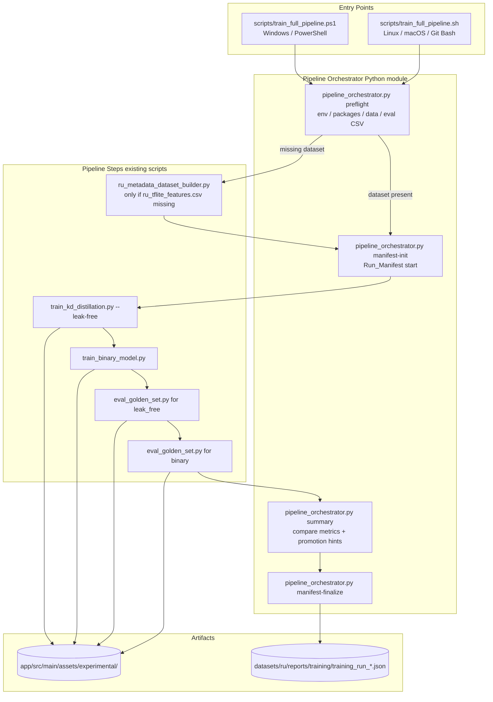
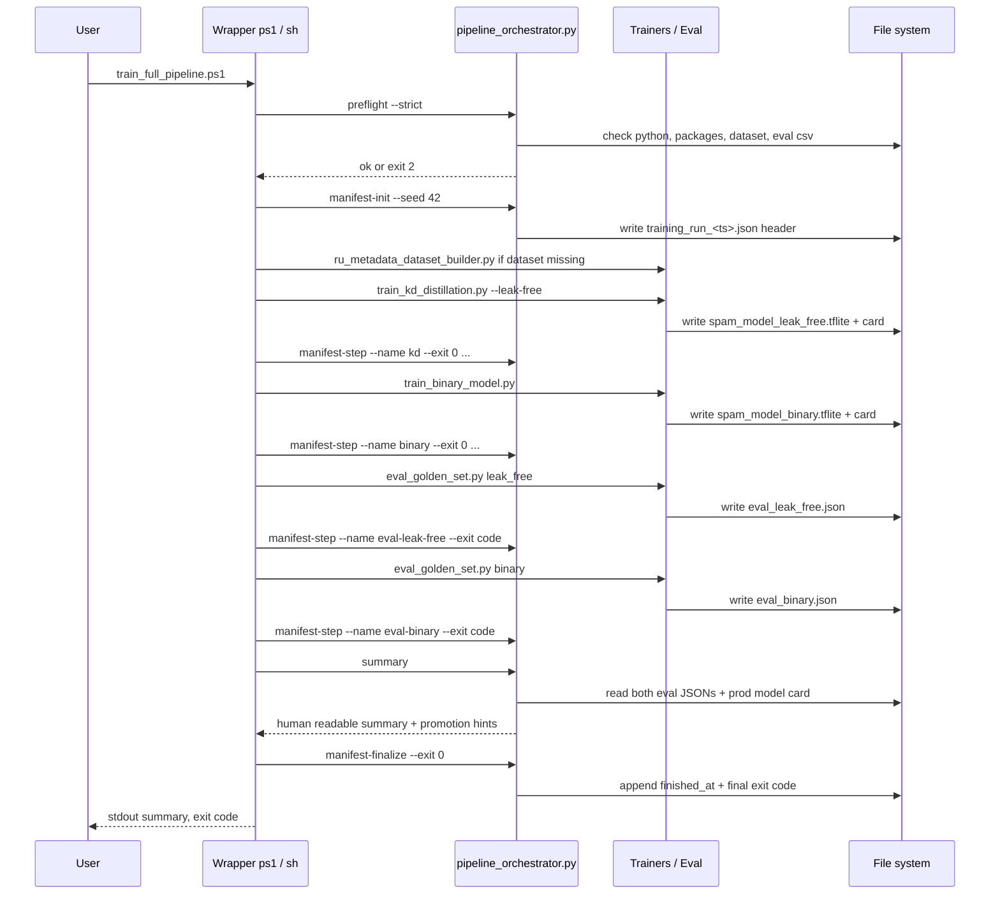

# Design Document

## Overview

Дизайн описывает оркестратор `Pipeline_Runner` для воспроизводимого обучения двух TFLite-моделей антиспама (`leak_free` 3-class KD и `binary` + Platt) поверх уже существующих Python-скриптов. Ключевая инженерная задача — не ML, а корректная последовательность вызовов, единые pre-flight проверки, защита продовых артефактов и кросс-платформенный запуск (PowerShell + Bash).

Принципы:

1. **Тонкая обёртка**. Pipeline_Runner — это две тонкие оболочки (`scripts/train_full_pipeline.sh` уже существует; добавляется `scripts/train_full_pipeline.ps1`) поверх Python-скриптов. Никакой ML-логики в обёртках нет.
2. **Общий ядерный модуль на Python**. Чтобы избежать дублирования pre-flight проверок, формирования Run_Manifest и сравнения метрик между Bash и PowerShell, эта логика выносится в один модуль `scripts/pipeline_orchestrator.py`. Bash и PowerShell вызывают этот модуль для шагов, которые иначе пришлось бы кодировать дважды.
3. **Fail-fast**. Все проверки выполняются до тяжёлых шагов, ошибки сигнализируются через ненулевой exit code и человекочитаемое сообщение в stderr.
4. **Без молчаливых пропусков**. Отсутствие eval CSV или сырых данных — это ошибка, а не «skip».
5. **Производственные артефакты неприкосновенны**. Pipeline_Runner пишет только в `app/src/main/assets/experimental/` и `datasets/ru/reports/`.

## Architecture



### Sequence: успешный прогон



## Components and Interfaces

### Component 1: PowerShell обёртка `scripts/train_full_pipeline.ps1`

**Назначение**. Точка входа на Windows. Эквивалент `train_full_pipeline.sh` по функциональности и аргументам.

**Контракт**:

```powershell
param(
    [int]$Seed = 42,
    [double]$MinBlockPrecision = 0.85,
    [double]$MinBlockRecall = 0.55,
    [double]$MaxAllowFpRate = 0.20,
    [switch]$SkipBinary,
    [switch]$SkipEval,
    [switch]$ForceRebuildDataset,
    [string]$PythonExe = ''   # если пусто — авто-резолв
)
```

**Поведение**:
- Резолвит `python.exe`: сначала `$PythonExe`, потом `C:\Users\Redmi\AppData\Local\Programs\Python\Python312\python.exe` (как в существующем `run.ps1`), потом `python` из PATH.
- Все остальные аргументы передаются через `pipeline_orchestrator.py` шагам как есть.
- Возвращает `exit $LASTEXITCODE`, чтобы CI мог реагировать на код возврата.

**Эквивалентный Bash-обёртка** `scripts/train_full_pipeline.sh` (уже существует, требуется доработать) принимает те же параметры через флаги командной строки:

```
train_full_pipeline.sh \
    [--seed N] \
    [--min-block-precision X] \
    [--min-block-recall X] \
    [--max-allow-fp-rate X] \
    [--skip-binary] \
    [--skip-eval] \
    [--force-rebuild-dataset]
```

### Component 2: Python-ядро `scripts/pipeline_orchestrator.py`

Делится на CLI-подкоманды; каждая возвращает структурированный exit code.

#### 2.1 `preflight`

**Вход**: `--strict` (boolean, default true), `--dataset-path`, `--eval-csv-path`.

**Действия**:
1. Читает `sys.version_info`, требует ≥ (3, 10).
2. Импортирует `tensorflow`, `catboost`, `sklearn`, `numpy` через `importlib.import_module`. Любой `ImportError` → exit 2 с текстом «Missing package: X. Install via: pip install tensorflow catboost scikit-learn numpy».
3. Проверяет `os.path.isfile(dataset_path)`. Если нет — печатает рекомендацию и возвращает специальный exit 10 (signals «нужно собрать датасет»).
4. Если файл есть — открывает, считывает количество строк (через `csv.reader`, не `wc -l`). Если 0 строк данных — exit 2.
5. Проверяет `eval_csv_path`: существует и содержит ≥ 100 data-строк. Иначе exit 2.

**Exit codes**:
- `0` — все проверки пройдены.
- `2` — ошибка окружения, прерываем.
- `10` — датасет отсутствует, обёртка должна вызвать Dataset_Builder и затем перезапустить `preflight`.

**Stdout**: одна строка JSON с результатом, чтобы обёртки могли парсить (для возможного UI).

#### 2.2 `manifest-init`

**Вход**: `--seed`, `--dataset-path`, `--eval-csv-path`, `--reports-dir`.

**Действия**:
1. Считает SHA-256 датасета и eval CSV (стримово, без полной загрузки в память).
2. Получает `git rev-parse HEAD` и `git status --porcelain` через `subprocess.run`. Любая ошибка → `git_sha = "unknown"`, `git_dirty = null`.
3. Получает `platform.system()`, `platform.release()`, `sys.version`.
4. Создаёт `datasets/ru/reports/training/training_run_<ts>.json` с полями из Requirement 7.3 и `steps: []`. Если каталог `training/` отсутствует — создаёт через `Path.mkdir(parents=True, exist_ok=True)`.
5. Печатает абсолютный путь манифеста в stdout — обёртка сохранит его в переменную для последующих вызовов.

#### 2.3 `manifest-step`

**Вход**: `--manifest`, `--name`, `--started-at`, `--finished-at`, `--exit-code`, `--artifact` (повторяемый).

**Действия**: атомарно обновляет JSON через read → modify → write в temp file → `os.replace`. Никогда не валится по гонке, потому что обёртка вызывает шаги последовательно.

#### 2.4 `summary`

**Вход**: `--manifest`, `--experimental-dir`, `--prod-model-card`.

**Действия**:
1. Читает `eval_leak_free.json`, `eval_binary.json`, `model_card_leak_free.json`, `model_card_binary.json`, `model_card.json` (если есть).
2. Извлекает блок-precision, блок-recall, allow FP rate для каждой модели и текущего prod.
3. Применяет правило промоушена из Requirement 9.1 → выдаёт для каждой модели `eligible_for_promotion: true|false` плюс причину.
4. Печатает таблицу в stdout (ASCII, без unicode box-drawing — терминал PowerShell на Windows бывает в cp866).
5. Печатает готовые команды копирования: `Copy-Item ...` если `os.name == 'nt'`, иначе `cp ...`. На Windows из Git Bash — печатает обе формы и помечает.

#### 2.5 `manifest-finalize`

**Вход**: `--manifest`, `--exit-code`. Дописывает `finished_at` и `final_exit_code`.

### Component 3: Существующие тренеры и eval (`Steps`)

Не модифицируются по поведению. Обёртка передаёт им флаги, идентичные текущему `train_full_pipeline.sh`. Единственное расширение — Pipeline_Runner проверяет код возврата и записывает его в Run_Manifest.

### Component 4: Конфигурационные дефолты

Все хардкоженные пути и пороги вынесены в верх `pipeline_orchestrator.py` как константы:

```python
REPO_ROOT = pathlib.Path(__file__).resolve().parent.parent
DATASET_PATH = REPO_ROOT / "datasets" / "ru" / "processed" / "ru_tflite_features.csv"
EVAL_CSV_PATH = REPO_ROOT / "datasets" / "ru" / "eval" / "cold_eval_600.csv"
EXPERIMENTAL_DIR = REPO_ROOT / "app" / "src" / "main" / "assets" / "experimental"
PROD_MODEL_CARD = REPO_ROOT / "app" / "src" / "main" / "assets" / "model_card.json"
REPORTS_DIR = REPO_ROOT / "datasets" / "ru" / "reports" / "training"
DEFAULT_THRESHOLDS = {
    # Источник дефолтов: текущий scripts/train_full_pipeline.sh (cold-eval baseline).
    # Не путать с eval_golden_set.py CLI-дефолтами (0.85 / 0.55 / 0.15) и со «строгим»
    # вариантом из шапки скрипта (0.90 / 0.60 / 0.10). Прод model_card.json показывает
    # cold-метрики ≈ block_precision 0.95 / block_recall 0.69 / allow_fp 0.16, поэтому
    # baseline сделан мягче по recall и FP — иначе даже текущая prod-модель не проходит.
    # Для строгого регрессионного gate используются override-флаги (Req 5.3, 8.5).
    "min_block_precision": 0.85,
    "min_block_recall": 0.55,
    "max_allow_fp_rate": 0.20,
}
DEFAULT_SEED = 42
REQUIRED_PACKAGES = ("tensorflow", "catboost", "sklearn", "numpy")
MIN_PYTHON = (3, 10)
LEAK_FREE_FORBIDDEN_FEATURES = (
    "reputationScore", "sourceConfidence", "reviewsLog", "negativeRatio",
    "searchVolumeLog", "hasFraudCategory", "hasTelemarketingCategory",
    "inAllowlist", "inBlacklist",
)
```

## Data Models

### Run_Manifest

```jsonc
{
  "schema_version": 1,
  "started_at": "2025-02-14T10:23:11Z",
  "finished_at": "2025-02-14T10:58:40Z",
  "final_exit_code": 0,
  "host_os": "Windows-10-10.0.19045",
  "python_version": "3.12.1",
  "git_sha": "9b1f3c2",
  "git_dirty": false,
  "seed": 42,
  "dataset_path": "datasets/ru/processed/ru_tflite_features.csv",
  "dataset_sha256": "ab12...",
  "dataset_row_count": 18420,
  "eval_csv_path": "datasets/ru/eval/cold_eval_600.csv",
  "eval_csv_sha256": "ef34...",
  "thresholds": {
    "min_block_precision": 0.85,
    "min_block_recall": 0.55,
    "max_allow_fp_rate": 0.20
  },
  "steps": [
    {
      "name": "preflight",
      "started_at": "...",
      "finished_at": "...",
      "exit_code": 0,
      "artifact_paths": []
    },
    {
      "name": "dataset-build",
      "started_at": "...",
      "finished_at": "...",
      "exit_code": 0,
      "artifact_paths": ["datasets/ru/processed/ru_tflite_features.csv"],
      "skipped": true,
      "skipped_reason": "dataset already exists"
    },
    {
      "name": "train-leak-free",
      "started_at": "...",
      "finished_at": "...",
      "exit_code": 0,
      "artifact_paths": [
        "app/src/main/assets/experimental/spam_model_leak_free.tflite",
        "app/src/main/assets/experimental/model_card_leak_free.json"
      ]
    },
    { "name": "train-binary", "exit_code": 0, ... },
    { "name": "eval-leak-free", "exit_code": 0, "gate_failed": false, ... },
    { "name": "eval-binary", "exit_code": 1, "gate_failed": true, ... }
  ]
}
```

### Eval JSON (уже существующий формат `eval_golden_set.py`)

Используется как есть. `summary` читает поля `metrics.block_precision`, `metrics.block_recall`, `metrics.allow_fp_rate`, `gate_passed`. Если структура изменится — `summary` падает с понятной ошибкой и просьбой обновить.

### Model Card

Формат уже определён `train_kd_distillation.py` и `train_binary_model.py`. Pipeline_Runner не модифицирует, только читает поля `metrics.*` для сравнения.

## Error Handling

| Сценарий | Кто детектит | Exit code | Действие Pipeline_Runner |
|---|---|---|---|
| Python < 3.10 | `preflight` | 2 | Печать «требуется Python ≥ 3.10», прерывание до Manifest_Init |
| Отсутствует пакет (`tensorflow` и т. п.) | `preflight` | 2 | Печать имени пакета и `pip install ...`, прерывание |
| Отсутствует `ru_tflite_features.csv` | `preflight` | 10 | Обёртка вызывает `ru_metadata_dataset_builder.py`, затем повторно `preflight`. Если опять отсутствует или 0 строк — exit 2 |
| Отсутствует или пустой `cold_eval_600.csv` | `preflight` | 2 | Прерывание с явным сообщением о требуемом пути |
| `train_kd_distillation.py` упал | Wrapper | проброс exit code | `manifest-step --exit-code N`, затем `manifest-finalize`, exit пайплайна = N |
| `train_binary_model.py` упал | Wrapper | проброс | Записать в манифест, продолжить eval только для leak-free, в финале exit = max(exit_codes) |
| `eval_golden_set.py` exit 1 (gate failed) | Wrapper | 0 для пайплайна | Записать `gate_failed: true`, продолжить, в summary пометить «не рекомендуется к промоушену» |
| `eval_golden_set.py` exit 2 (I/O / parse) | Wrapper | проброс 2 | Прерывание |
| Ошибка записи Run_Manifest | `pipeline_orchestrator` | 2 | Печать stderr, прерывание |
| `--skip-binary` + `--skip-eval` | Wrapper | 0 (если leak-free прошёл) | В summary явно: «binary не обучен, ни одна модель не прошла eval — промоушен запрещён» |

**Правило**: ни один шаг не подавляет ошибки молча. Любой exit code ≠ 0 от подпроцесса обязан попасть в Run_Manifest. Финальный exit Pipeline_Runner = максимум по `final_exit_code` шагов, кроме gate-failed (тот не считается фатальным для пайплайна целиком — обработка его — задача релиз-инженера через summary).

## Testing Strategy

### PBT applicability

Property-based testing для этого пайплайна **не применим**. Причины:

1. Pipeline_Runner — это оркестратор побочных эффектов: запуск subprocess, чтение/запись файлов, проверка существования путей. Универсальных свойств вида «для всех X выполняется P(X)» здесь нет.
2. Тяжёлые шаги (обучение моделей, eval) — это вызовы существующих ML-скриптов, тестировать их через 100 итераций нерационально (одно обучение ≈ 30 минут, требует TensorFlow).
3. Чистая логика, которую можно было бы покрыть свойствами (например, агрегация метрик из JSON), тривиальна и лучше тестируется примерами.

Вместо PBT — example-based unit tests + integration smoke test.

### Unit tests (`tests/test_pipeline_orchestrator.py`)

1. **preflight: Python version check** — мокаем `sys.version_info`, проверяем exit 2 при < 3.10.
2. **preflight: missing package** — мокаем `importlib.import_module`, чтобы `tensorflow` бросал `ImportError`. Ожидаем exit 2 и текст «Missing package: tensorflow».
3. **preflight: missing dataset** — `tmp_path` без датасета. Ожидаем exit 10 (signal к dataset-build), не 2.
4. **preflight: empty dataset** — `tmp_path` с пустым CSV. Ожидаем exit 2.
5. **preflight: missing eval csv** — eval отсутствует. Ожидаем exit 2 и явное упоминание `cold_eval_600.csv`.
6. **preflight: tiny eval csv** — eval с 50 строками. Ожидаем exit 2.
7. **manifest-init: git unavailable** — мокаем `subprocess.run` так, чтобы git падал. Ожидаем `git_sha == "unknown"` и exit 0.
8. **manifest-step: append step** — два последовательных вызова, проверяем, что `steps` имеет два элемента и оригинальные поля не потёрты.
9. **summary: prod card missing** — нет `model_card.json`. Ожидаем поле `prod_metrics: "unavailable"` и exit 0.
10. **summary: gate-failed model marked not recommended** — `eval_binary.json` с `gate_passed: false`. Ожидаем строку «не рекомендуется к промоушену» в выводе.
11. **summary: copy command per OS** — мокаем `os.name = 'nt'` → ожидаем `Copy-Item`. `os.name = 'posix'` → ожидаем `cp`.
12. **manifest-finalize: appends finished_at and final_exit_code** — проверяем, что после вызова поля присутствуют и не дублируются.

### Integration smoke (опционально, помечен `*` в tasks)

Запуск `train_full_pipeline.ps1` (или `.sh`) с миниатюрным синтетическим датасетом (через флаг `--smoke-synthetic` `ru_metadata_dataset_builder.py`), `--skip-eval`. Проверка, что появились артефакты в `experimental/` и Run_Manifest со всеми ожидаемыми шагами. Не запускается в основном CI — слишком долго; запускается локально вручную.

### Cross-platform тесты

Для PowerShell-обёртки невозможно запустить unit-тесты без Windows-агента. Покрытие достигается через:
- Линтером: `Invoke-ScriptAnalyzer scripts/train_full_pipeline.ps1` (если установлен). Помечен опциональным.
- Проверка эквивалентности: один и тот же набор аргументов через обе обёртки даёт одинаковый набор подкоманд `pipeline_orchestrator.py`. Тестируется через golden-файл с ожидаемыми CLI-вызовами (мокаем `subprocess.run` в обёртке, проверяем call args). Это покрывается отдельным тестом `tests/test_pipeline_wrappers.py` — запускается только на платформе, где доступны обе оболочки (CI на Linux запускает sh-вариант, ручной запуск на Windows — ps1).

### Что не тестируется автоматически

- Корректность ML-метрик: это ответственность `train_kd_distillation.py` и `eval_golden_set.py`, у них свои тесты.
- TensorFlow детерминизм между платформами: за пределами зоны влияния пайплайна.
- Реальный промоушен: процедура ручная по дизайну.
