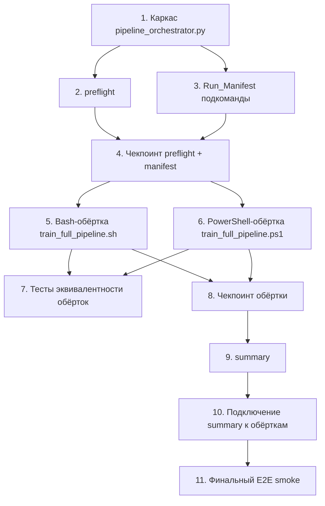

# Implementation Plan: Model Training Pipeline

## Overview

Имплементация инкрементальная: сначала появляется Python-ядро `pipeline_orchestrator.py` с pre-flight и манифестом, затем подключается к Bash-обёртке (она уже существует и нуждается только в адаптации), затем создаётся PowerShell-обёртка-двойник, в конце добавляется `summary` с человекочитаемым выводом и команды промоушена. Каждый блок заканчивается чекпоинтом.

Поскольку дизайн не содержит секции Correctness Properties (PBT не применим к оркестрации subprocess), все тестовые подзадачи — это example-based unit-тесты, помечены `*` и опциональны.

## Tasks

- [x] 1. Создать каркас `scripts/pipeline_orchestrator.py`
  - Создать файл с константами из «Component 4: Конфигурационные дефолты» (REPO_ROOT, DATASET_PATH, EVAL_CSV_PATH, EXPERIMENTAL_DIR, PROD_MODEL_CARD, REPORTS_DIR, DEFAULT_THRESHOLDS, DEFAULT_SEED, REQUIRED_PACKAGES, MIN_PYTHON, LEAK_FREE_FORBIDDEN_FEATURES)
  - Настроить argparse с подкомандами `preflight`, `manifest-init`, `manifest-step`, `summary`, `manifest-finalize`
  - Каждая подкоманда пока возвращает `NotImplementedError` с фиксированным exit code 99
  - _Requirements: 1.4, 7.3_

- [x] 2. Реализовать подкоманду `preflight`
  - [x] 2.1 Проверка версии Python и обязательных пакетов
    - Считать `sys.version_info`, сравнить с `MIN_PYTHON`
    - Импортировать каждый из `REQUIRED_PACKAGES` через `importlib.import_module`
    - При нехватке версии или пакета — печатать сообщение в stderr и exit 2
    - _Requirements: 1.5, 2.1, 2.2_
  
  - [x] 2.2 Unit-тесты для проверки окружения
    - Мокать `sys.version_info` и `importlib.import_module`
    - Покрыть кейсы: `Python < 3.10`, отсутствие `tensorflow`, отсутствие `catboost`
    - Проверять, что в stderr есть строка установки `pip install tensorflow catboost scikit-learn numpy`
    - _Requirements: 1.5, 2.1, 2.2_
  
  - [x] 2.3 Проверка наличия и непустоты датасета
    - Если `DATASET_PATH` отсутствует — exit 10 (сигнал «нужно собрать»)
    - Если файл существует — открыть csv.reader, посчитать data-строки (без заголовка)
    - Если 0 строк — exit 2 с сообщением о необходимых сырых входах (`ru_call_features.csv`, `ru_numbers_labeled.csv`, `ru_reputation_raw.csv`)
    - _Requirements: 2.3, 2.4, 2.5_
  
  - [x] 2.4 Unit-тесты проверки датасета
    - Кейсы: отсутствует файл (exit 10), пустой файл (exit 2), 1+ строк (exit 0)
    - Использовать `tmp_path` pytest fixture
    - _Requirements: 2.3, 2.4, 2.5_
  
  - [x] 2.5 Проверка eval CSV
    - `EVAL_CSV_PATH` должен существовать и содержать ≥ 100 data-строк
    - Любое нарушение — exit 2 с явным упоминанием `datasets/ru/eval/cold_eval_600.csv`
    - _Requirements: 2.6, 2.7_
  
  - [x] 2.6 Unit-тесты eval CSV
    - Кейсы: файла нет, файл с 50 строками, файл со 100+ строками
    - _Requirements: 2.6, 2.7_

- [x] 3. Реализовать подкоманды Run_Manifest
  - [x] 3.1 `manifest-init`: создание манифеста
    - Считать SHA-256 датасета и eval CSV стримово (chunked read)
    - Получить git SHA через `subprocess.run(["git", "rev-parse", "HEAD"], ...)` — при ошибке записать `"unknown"`
    - Получить git dirty через `git status --porcelain` — при ошибке `null`
    - Получить `platform.system() + platform.release()`, `sys.version`
    - Записать в `datasets/ru/reports/training/training_run_<UTC_TIMESTAMP>.json` JSON по схеме из «Data Models / Run_Manifest» с `steps: []` (создать каталог `training/`, если его нет)
    - Печатать абсолютный путь манифеста в stdout
    - _Requirements: 7.1, 7.2, 7.3, 7.4_
  
  - [x] 3.2 `manifest-step`: атомарная дозапись шага
    - Принимать `--manifest`, `--name`, `--started-at`, `--finished-at`, `--exit-code`, `--artifact` (action=append), `--gate-failed` (optional bool), `--skipped` (optional bool), `--skipped-reason`
    - Алгоритм: read JSON → append to `steps[]` → write to temp file → `os.replace` (atomic)
    - _Requirements: 5.5, 7.3, 8.3, 8.4_
  
  - [x] 3.3 `manifest-finalize`: завершение манифеста
    - Принимать `--manifest`, `--exit-code`
    - Дописывать `finished_at` (текущий UTC) и `final_exit_code`
    - Идемпотентно: повторный вызов не должен дублировать
    - _Requirements: 7.5_
  
  - [x] 3.4 Unit-тесты манифеста
    - `manifest-init`: мокать `subprocess.run` для git (success, failure)
    - `manifest-step`: проверить два последовательных вызова, что оба шага сохранились
    - `manifest-finalize`: проверить идемпотентность повторного вызова
    - _Requirements: 7.3, 7.4, 7.5_

- [x] 4. Чекпоинт — Pre-flight и Run_Manifest работают
  - Запустить вручную `python scripts/pipeline_orchestrator.py preflight` и `manifest-init` на текущем репозитории
  - Убедиться, что preflight даёт exit 10 (отсутствует `ru_tflite_features.csv`) или exit 0
  - Убедиться, что `manifest-init` создаёт валидный JSON в `datasets/ru/reports/`
  - Ensure all tests pass, ask the user if questions arise.

- [x] 5. Доработать Bash-обёртку `scripts/train_full_pipeline.sh`
  - [x] 5.1 Добавить парсинг новых флагов
    - `--seed`, `--min-block-precision`, `--min-block-recall`, `--max-allow-fp-rate`, `--skip-binary`, `--skip-eval`, `--force-rebuild-dataset`
    - Дефолты совпадают с `DEFAULT_THRESHOLDS` и `DEFAULT_SEED` из оркестратора
    - _Requirements: 5.3, 8.1, 8.2_
  
  - [x] 5.2 Заменить inline-проверку датасета на вызов `pipeline_orchestrator.py preflight`
    - При exit 10 запускать `python3 scripts/ru_metadata_dataset_builder.py`, затем повторить preflight
    - При exit 2 — прерывать, как сейчас
    - _Requirements: 2.3, 2.4, 2.5, 2.6, 2.7_
  
  - [x] 5.3 Обернуть каждый шаг (KD-train, binary-train, eval ×2) в запись `manifest-step`
    - Захватывать `started_at` и `finished_at` через `date -u +%Y-%m-%dT%H:%M:%SZ`
    - Захватывать exit code каждого подпроцесса; для eval отличать exit 1 (gate failed) от exit 2 (I/O)
    - При exit 2 от eval — прерывать пайплайн
    - При exit 1 от eval — продолжать, помечать `--gate-failed true`
    - _Requirements: 4.4, 5.4, 5.5, 5.6, 7.3_
  
  - [x] 5.4 Реализовать `--skip-binary` и `--skip-eval`
    - Если `--skip-binary`: не запускать `train_binary_model.py` и `eval_golden_set.py` для binary; записать `manifest-step --name=train-binary --skipped true`
    - Если `--skip-eval`: не запускать оба eval; записать пропуск
    - _Requirements: 8.1, 8.2, 8.3, 8.4_
  
  - [x] 5.5 Добавить вызов `summary` и `manifest-finalize` в конце
    - `summary` после всех шагов
    - `manifest-finalize` на любом пути выхода (через `trap EXIT`)
    - _Requirements: 6.3, 6.4, 7.5, 9.1, 9.2, 9.4_

- [x] 6. Создать PowerShell-обёртку `scripts/train_full_pipeline.ps1`
  - [x] 6.1 Каркас и резолв Python
    - `param(...)` блок с теми же параметрами, что у Bash-обёртки (см. «Component 1»)
    - Резолв `$PythonExe`: param value → жёсткий путь `Python312\python.exe` → `python` из PATH
    - `$ErrorActionPreference = 'Stop'`
    - _Requirements: 1.1, 1.3_
  
  - [x] 6.2 Запуск preflight и опционально dataset builder
    - `& $PythonExe scripts/pipeline_orchestrator.py preflight`
    - При `$LASTEXITCODE -eq 10`: вызвать `& $PythonExe scripts/ru_metadata_dataset_builder.py`, затем повторить preflight
    - При `$LASTEXITCODE -eq 2`: `exit $LASTEXITCODE`
    - _Requirements: 1.5, 2.1, 2.2, 2.3, 2.4, 2.5_
  
  - [x] 6.3 Запуск всех шагов с записью в манифест
    - Логика идентична Bash-обёртке: KD → binary → eval ×2
    - Время через `(Get-Date).ToUniversalTime().ToString("yyyy-MM-ddTHH:mm:ssZ")`
    - Захват exit code через `$LASTEXITCODE` сразу после каждого вызова
    - _Requirements: 1.2, 1.4, 5.4, 5.5, 5.6, 7.3_
  
  - [x] 6.4 Реализовать `-SkipBinary`, `-SkipEval`, `-ForceRebuildDataset`
    - Семантика идентична `--skip-binary`, `--skip-eval`, `--force-rebuild-dataset` в Bash
    - _Requirements: 8.1, 8.2, 8.3, 8.4_
  
  - [x] 6.5 Обеспечить `manifest-finalize` через `try/finally`
    - Сохранить путь манифеста в переменную после `manifest-init`
    - В `finally` блоке вызвать `manifest-finalize` независимо от исхода
    - `exit $LASTEXITCODE` в самом конце
    - _Requirements: 7.5_

- [x] 7. Тесты эквивалентности обёрток
  - Файл `tests/test_pipeline_wrappers.py`
  - Парсить обе обёртки на наличие одинаковых ключевых вызовов: `train_kd_distillation.py --leak-free --seed`, `train_binary_model.py --binary-warn-strategy merge_block --seed`, `eval_golden_set.py ... --cold ... --output-json`
  - Использовать regex по содержимому файлов, без фактического запуска
  - _Requirements: 1.2, 1.4_

- [x] 8. Чекпоинт — Обёртки запускают полный пайплайн
  - Запустить `scripts/train_full_pipeline.sh --skip-eval` на машине с готовым `ru_tflite_features.csv` или с `--force-rebuild-dataset`
  - Запустить `scripts/train_full_pipeline.ps1 -SkipEval` на Windows аналогично
  - Убедиться, что артефакты в `experimental/` появились и Run_Manifest валидный
  - Ensure all tests pass, ask the user if questions arise.

- [x] 9. Реализовать подкоманду `summary`
  - [x] 9.1 Чтение eval JSON и model cards
    - Загрузить `eval_leak_free.json`, `eval_binary.json` из `EXPERIMENTAL_DIR` (если существуют)
    - Извлечь `metrics.block_precision`, `metrics.block_recall`, `metrics.allow_fp_rate`, `gate_passed`
    - Если ключа нет — записать `null` и продолжить, не падать
    - Если файла eval нет — пометить модель `not_evaluated`
    - _Requirements: 5.4, 6.4, 8.4, 9.1_
  
  - [x] 9.2 Чтение текущего prod model card
    - Если `PROD_MODEL_CARD` существует — извлечь те же 3 метрики
    - Если отсутствует — записать `prod_metrics: "unavailable"`
    - _Requirements: 9.2, 9.3_
  
  - [x] 9.3 Применить правило промоушена и собрать ASCII-таблицу
    - Правило: `eligible = block_precision >= prod.block_precision AND block_recall >= prod.block_recall - 0.05`
    - Если `prod_metrics == "unavailable"` — `eligible = gate_passed` (не блокировать по prod)
    - Если `gate_passed == false` — `eligible = false` независимо от метрик
    - Печатать таблицу: имя модели, block_p, block_r, allow_fp, gate_passed, eligible, причина
    - Использовать ASCII-символы (`+`, `-`, `|`), не unicode box-drawing
    - _Requirements: 5.5, 6.4, 6.5, 9.1_
  
  - [x] 9.4 Печать команд промоушена под текущую ОС
    - Если `os.name == 'nt'`: `Copy-Item app/src/main/assets/experimental/spam_model_<X>.tflite app/src/main/assets/spam_model.tflite -Force` и аналогично для card
    - Иначе: `cp app/src/main/assets/experimental/spam_model_<X>.tflite app/src/main/assets/spam_model.tflite`
    - Печатать команду для каждой `eligible` модели, плюс пометку «не рекомендуется» для не-eligible
    - _Requirements: 6.3, 6.4, 9.4_
  
  - [x] 9.5 Unit-тесты summary
    - Кейсы: `prod_metrics unavailable`, `gate_passed false → not recommended`, `os.name == 'nt' → Copy-Item`, `os.name == 'posix' → cp`
    - Использовать `tmp_path` для подмены EXPERIMENTAL_DIR через monkeypatch
    - _Requirements: 6.3, 6.4, 6.5, 9.1, 9.2, 9.3, 9.4_

- [x] 10. Подключить `summary` к обёрткам
  - В Bash-обёртке: вызов `python3 scripts/pipeline_orchestrator.py summary --manifest "$MANIFEST" --experimental-dir "$EXPERIMENTAL" --prod-model-card "$ASSETS_DIR/model_card.json"`
  - В PowerShell-обёртке: аналогичный вызов через `& $PythonExe`
  - Убедиться, что summary печатается в stdout до `manifest-finalize`
  - _Requirements: 6.3, 6.4, 9.1, 9.2, 9.4_

- [x] 11. Финальный чекпоинт — End-to-end smoke
  - На машине с `ru_tflite_features.csv` и `cold_eval_600.csv` запустить полный пайплайн без флагов skip
  - Проверить наличие всех 4 артефактов в `experimental/` и обоих eval JSON
  - Проверить, что Run_Manifest содержит все 6 шагов (preflight, dataset-build [skipped], train-leak-free, train-binary, eval-leak-free, eval-binary)
  - Проверить, что `app/src/main/assets/spam_model.tflite` и `model_card.json` НЕ изменились (сравнить SHA-256 до и после)
  - Ensure all tests pass, ask the user if questions arise.

## Task Dependency Graph



Параллелизация: после T4 шаги T5 (Bash) и T6 (PowerShell) независимы и могут идти параллельно. T7 — необязательный кросс-тест, требует обе обёртки.

```json
{
  "waves": [
    { "wave": 1, "tasks": ["1"] },
    { "wave": 2, "tasks": ["2", "3"] },
    { "wave": 3, "tasks": ["4"] },
    { "wave": 4, "tasks": ["5", "6"] },
    { "wave": 5, "tasks": ["7", "8"] },
    { "wave": 6, "tasks": ["9"] },
    { "wave": 7, "tasks": ["10"] },
    { "wave": 8, "tasks": ["11"] }
  ]
}
```

## Notes

- Подзадачи с `*` (`* 2.2`, `* 2.4`, `* 2.6`, `* 3.4`, `* 7`, `* 9.5`) — опциональные тесты, можно пропустить для быстрого MVP. Основная имплементация (`5.x`, `6.x`, `9.1`–`9.4`, `10`) обязательна.
- Каждый шаг ссылается на конкретные acceptance criteria из `requirements.md`; используйте эти ссылки при ревью PR.
- Пайплайн принципиально не трогает `app/src/main/assets/spam_model.tflite` — промоушен ручной по дизайну (Requirement 6).
- Если на каком-то шаге обнаружится недостаток в дизайне (например, окажется, что `eval_golden_set.py` возвращает другую структуру JSON), вернитесь к `design.md` и обновите его до продолжения имплементации.
